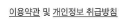

# 1주차
- Text, Button, Modifier(https://developer.android.com/jetpack/compose/modifiers?hl=ko)
- Surface, Box, Row, Column
- BoxWithConstraints

## Text
https://developer.android.com/jetpack/compose/text?hl=ko

### 텍스트 표시
```kotlin
@Composable
fun SimpleText() {
    Text("Hello World")

    Text(stringResource(R.string.hello_world))
}
```

### 텍스트 스타일 지정
```kotlin
@Composable
fun StyleText() {
    Text(
            text = "Hello World",
            color = Color.Blue,
            fontSize = 30.sp,
            fontStyle = FontStyle.Italic,
            fontWeight = FontWeight.Bold,
            textAlign = TextAlign.Center,
    )
}
```

#### 그림자
```kotlin
@Preview(showBackground = true)
@Composable
fun TextShadow() {
    val offset = Offset(5.0f, 10.0f)
    Text(
            text = "Hello world!",
            style = TextStyle(
                    fontSize = 24.sp,
                    shadow = Shadow(
                            color = Color.Blue,
                            offset = offset,
                            blurRadius = 3f
                    )
            )
    )
}
```


#### 글꼴 작업
```kotlin
@Composable
fun DifferentFonts() {
    Column {
        Text("Hello World", fontFamily = FontFamily.Serif)
        Text("Hello World", fontFamily = FontFamily.SansSerif)
    }
}
```

`fontFamily` 속성을 사용하여 `res/font` 폴더에 정의된 맞춤 글꼴 및 서체로 작업할 수 있다.

```kotlin
val firaSansFamily = FontFamily(
        Font(R.font.firasans_light, FontWeight.Light),
        Font(R.font.firasans_regular, FontWeight.Normal),
        Font(R.font.firasans_italic, FontWeight.Normal, FontStyle.Italic),
        Font(R.font.firasans_medium, FontWeight.Medium),
        Font(R.font.firasans_bold, FontWeight.Bold)
)

Column {
    Text(..., fontFamily = firaSansFamily, fontWeight = FontWeight.Light)
    Text(..., fontFamily = firaSansFamily, fontWeight = FontWeight.Normal)
    Text(
            ..., fontFamily = firaSansFamily, fontWeight = FontWeight.Normal,
    fontStyle = FontStyle.Italic
    )
    Text(..., fontFamily = firaSansFamily, fontWeight = FontWeight.Medium)
    Text(..., fontFamily = firaSansFamily, fontWeight = FontWeight.Bold)
}
```

#### 텍스트 내 여러 스타일 (AnnotatedString)
   
원하는 부분에만 밑줄을 만들고 싶은 경우 사용

`AnnotatedString` 데이터 클래스를 사용해야 한다.
- `Text` 값
- `SpanStyleRange`의 `List`: 텍스트 값 내의 위치 범위가 포함되는 인라인 스타일 지정과 동일함
- `ParagraphStyleRange`의 `List`: 텍스트 정렬, 텍스트 방향, 줄 간격, 텍스트 들여쓰기 스타일 지정

`SpanStyle`과 `ParagraphStyle`의 차이점은 `ParagraphStyle`은 전체 단락에 적용할 수 있고 `SpanStyle`은 문자 수준에서 적용할 수 있다는 것입니다. 텍스트의 한 부분이 `ParagraphStyle`로 표시되면 이 부분은 시작과 끝에 줄 바꿈이 있는 것처럼 나머지 부분과 분리됩니다.

`buildAnnotatedString` 빌더를 사용하여 `AnnotatedString`을 만듭니다.
```kotlin
@Composable
fun MultipleStylesInText() {
    Text(
        buildAnnotatedString {
            withStyle(style = SpanStyle(color = Color.Blue)) {
                append("H")
            }
            append("ello ")

            withStyle(style = SpanStyle(fontWeight = FontWeight.Bold, color = Color.Red)) {
                append("W")
            }
            append("orld")
        }
    )
}
```
   

```kotlin
@Composable
fun ParagraphStyle() {
    Text(
        buildAnnotatedString {
            withStyle(style = ParagraphStyle(lineHeight = 30.sp)) {
                withStyle(style = SpanStyle(color = Color.Blue)) {
                    append("Hello\n")
                }
                withStyle(
                    style = SpanStyle(
                        fontWeight = FontWeight.Bold,
                        color = Color.Red
                    )
                ) {
                    append("World\n")
                }
                append("Compose")
            }
        }
    )
}
```
   

### 최대 줄 수, 텍스트 오버플로
```kotlin
@Composable
fun LongText() {
    Text("hello ".repeat(50), maxLines = 2)
}

@Composable
fun OverflowedText() {
    Text("Hello Compose ".repeat(50), maxLines = 2, overflow = TextOverflow.Ellipsis)
}
```

### includeFontPadding
```kotlin
/* Copyright 2022 Google LLC.
SPDX-License-Identifier: Apache-2.0 */
 
@OptIn(ExperimentalTextApi::class)
/* ... */

Text(
 text = myText,
 style = TextStyle(
   lineHeight = 2.5.em,
   platformStyle = PlatformTextStyle(
     includeFontPadding = false
   )
   /* ... */
  )
)

/* Copyright 2022 Google LLC.
SPDX-License-Identifier: Apache-2.0 */

@OptIn(ExperimentalTextApi::class)
val Typography = Typography(
        body1 = TextStyle(
                fontFamily = /* ... */,
                fontSize = /* ... */,
                platformStyle = PlatformTextStyle(
                        includeFontPadding = false
                )
                /* ... */
        )

                MaterialTheme(
                typography = Typography,
        /* ... */
)
```

Compose 1.2.0-alpha07 버전에서 TextStyle/PlatformTextStyle 에 includeFontPadding 을 제어할 수 있는 API를 제공합니다. 기본값은 true 입니다.

API는 exprerimental, deprecated 된 것으로 표시되며, 호환성 목적으로만 사용됩니다. 향후 릴리즈에서는 includeFontPadding 의 기본값을 false 로 설정할 것이고, 궁극적으로는 호환성 API를 제거할 예정입니다. (***사용 중인 Compose 버전에서 includeFontPadding이 제대로 먹히는지 확인해볼 필요 있음***)

무엇보다 각 Text 컴포저블별로 구성할 수 있으므로 마이그레이션을 점진적으로 진행할 수 있다는 장점이 있습니다.

https://velog.io/@hoyaho/%EB%B2%88%EC%97%AD-Jetpack-Compose-%EC%97%90%EC%84%9C-%ED%8F%B0%ED%8A%B8-%ED%8C%A8%EB%94%A9%EC%9D%84-%EC%88%98%EC%A0%95%ED%95%98%EB%8A%94-%EB%B0%A9%EB%B2%95   

### lineHeight Api
em은 자기 자신의 font-size를 기준으로 합니다. font-size가 30.sp인 text의 2em은 60.sp입니다.

```kotlin
@Composable
fun AlignedText() {
    Text(
        text = myText,
        style = LocalTextStyle.current.merge(
            TextStyle(
                lineHeight = 2.5.em,
                platformStyle = PlatformTextStyle(
                    includeFontPadding = false
                ),
                lineHeightStyle = LineHeightStyle(
                    alignment = LineHeightStyle.Alignment.Center,
                    trim = LineHeightStyle.Trim.None
                )
            )
        )
    )
}
```   

또한 LineHeightStyle Api를 사용하여 텍스트의 중심과 스타일을 지정할 수 있습니다. (단, includeFontPadding이 false로 설정되어야함.)   


## 사용자 상호작용
텍스트 선택 기능을 사용 설정하려면 텍스트 요소를 SelectionContainer 컴포저블로 래핑해야 합니다.
```kotlin
@Composable
fun SelectableText() {
    SelectionContainer {
        Text("This text is selectable")
    }
}
```

   

선택 가능한 영역의 특정 부분에서 선택 기능을 사용 중지해야 하는 경우도 있습니다. 이렇게 하려면 선택 불가능한 부분을 DisableSelection 컴포저블로 래핑해야 합니다.

```kotlin
@Composable
fun PartiallySelectableText() {
    SelectionContainer {
        Column {
            Text("This text is selectable")
            Text("This one too")
            Text("This one as well")
            DisableSelection {
                Text("But not this one")
                Text("Neither this one")
            }
            Text("But again, you can select this one")
            Text("And this one too")
        }
    }
}
```   

### 텍스트에서 클릭 위치 가져오기
```kotlin
@Composable
fun SimpleClickableText() {
    ClickableText(
        text = AnnotatedString("Click Me"),
        onClick = { offset ->
            Log.d("ClickableText", "$offset -th character is clicked.")
        }
    )
}
```   

### 주석이 추가된 클릭
사용자가 Text 컴포저블을 클릭할 때 예를 들어 브라우저에서 열리는 특정 단어에 연결된 URL과 같이 Text 값의 부분에 정보를 추가해야 하는 경우, 아래와 같이 구현할 수 있습니다.
```kotlin
@Composable
fun AnnotatedClickableText() {
    val annotatedText = buildAnnotatedString {
        append("Click ")

        // We attach this *URL* annotation to the following content
        // until `pop()` is called
        pushStringAnnotation(tag = "URL",
                             annotation = "https://developer.android.com")
        withStyle(style = SpanStyle(color = Color.Blue,
                                    fontWeight = FontWeight.Bold)) {
            append("here")
        }

        pop()
    }

    ClickableText(
        text = annotatedText,
        onClick = { offset ->
            // We check if there is an *URL* annotation attached to the text
            // at the clicked position
            annotatedText.getStringAnnotations(tag = "URL", start = offset,
                                                    end = offset)
                .firstOrNull()?.let { annotation ->
                    // If yes, we log its value
                    Log.d("Clicked URL", annotation.item)
                }
        }
    )
}
```


