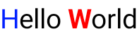
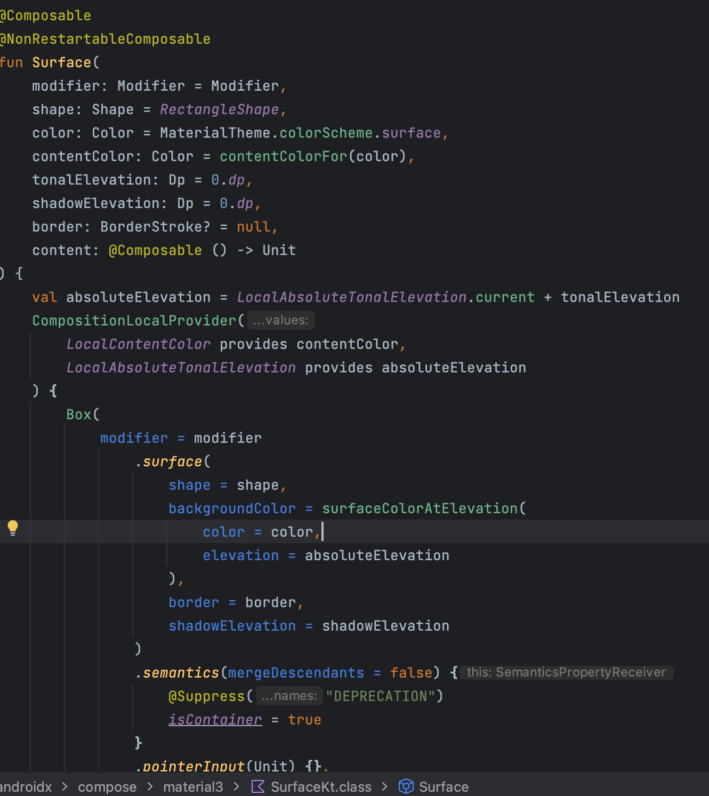
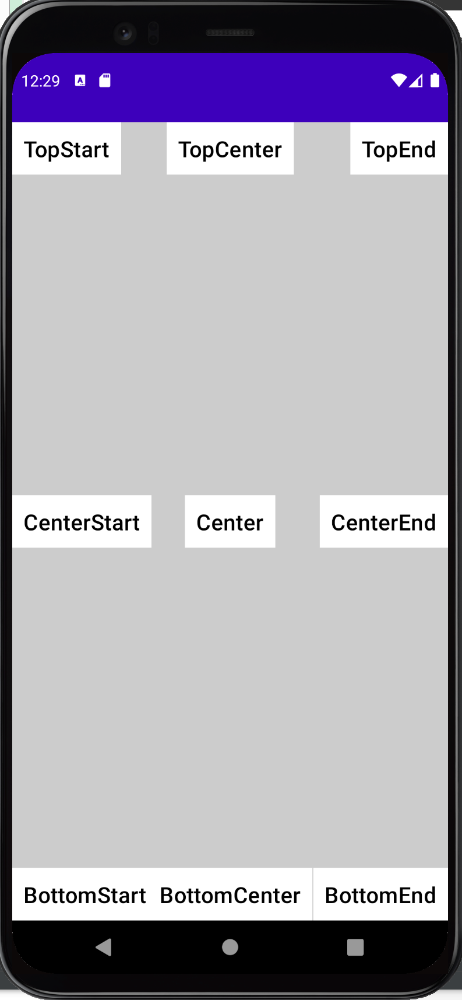
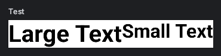
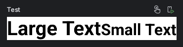
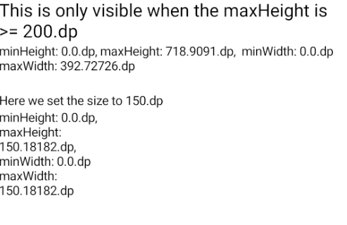

# 1주차
- Text, Button, Modifier(https://developer.android.com/jetpack/compose/modifiers?hl=ko)
- Surface, Box, Row, Column
- BoxWithConstraints

## Text
https://developer.android.com/jetpack/compose/text?hl=ko

### 텍스트 표시
```kotlin
@Composable
fun SimpleText() {
    Text("Hello World")

    Text(stringResource(R.string.hello_world))
}
```

### 텍스트 스타일 지정
```kotlin
@Composable
fun StyleText() {
    Text(
            text = "Hello World",
            color = Color.Blue,
            fontSize = 30.sp,
            fontStyle = FontStyle.Italic,
            fontWeight = FontWeight.Bold,
            textAlign = TextAlign.Center,
    )
}
```

#### 그림자
```kotlin
@Preview(showBackground = true)
@Composable
fun TextShadow() {
    val offset = Offset(5.0f, 10.0f)
    Text(
            text = "Hello world!",
            style = TextStyle(
                    fontSize = 24.sp,
                    shadow = Shadow(
                            color = Color.Blue,
                            offset = offset,
                            blurRadius = 3f
                    )
            )
    )
}
```


#### 글꼴 작업
```kotlin
@Composable
fun DifferentFonts() {
    Column {
        Text("Hello World", fontFamily = FontFamily.Serif)
        Text("Hello World", fontFamily = FontFamily.SansSerif)
    }
}
```

`fontFamily` 속성을 사용하여 `res/font` 폴더에 정의된 맞춤 글꼴 및 서체로 작업할 수 있다.

```kotlin
val firaSansFamily = FontFamily(
        Font(R.font.firasans_light, FontWeight.Light),
        Font(R.font.firasans_regular, FontWeight.Normal),
        Font(R.font.firasans_italic, FontWeight.Normal, FontStyle.Italic),
        Font(R.font.firasans_medium, FontWeight.Medium),
        Font(R.font.firasans_bold, FontWeight.Bold)
)

Column {
    Text(..., fontFamily = firaSansFamily, fontWeight = FontWeight.Light)
    Text(..., fontFamily = firaSansFamily, fontWeight = FontWeight.Normal)
    Text(
            ..., fontFamily = firaSansFamily, fontWeight = FontWeight.Normal,
    fontStyle = FontStyle.Italic
    )
    Text(..., fontFamily = firaSansFamily, fontWeight = FontWeight.Medium)
    Text(..., fontFamily = firaSansFamily, fontWeight = FontWeight.Bold)
}
```

#### 텍스트 내 여러 스타일 (AnnotatedString)
   
원하는 부분에만 밑줄을 만들고 싶은 경우 사용

`AnnotatedString` 데이터 클래스를 사용해야 한다.
- `Text` 값
- `SpanStyleRange`의 `List`: 텍스트 값 내의 위치 범위가 포함되는 인라인 스타일 지정과 동일함
- `ParagraphStyleRange`의 `List`: 텍스트 정렬, 텍스트 방향, 줄 간격, 텍스트 들여쓰기 스타일 지정

`SpanStyle`과 `ParagraphStyle`의 차이점은 `ParagraphStyle`은 전체 단락에 적용할 수 있고 `SpanStyle`은 문자 수준에서 적용할 수 있다는 것입니다. 텍스트의 한 부분이 `ParagraphStyle`로 표시되면 이 부분은 시작과 끝에 줄 바꿈이 있는 것처럼 나머지 부분과 분리됩니다.

`buildAnnotatedString` 빌더를 사용하여 `AnnotatedString`을 만듭니다.
```kotlin
@Composable
fun MultipleStylesInText() {
    Text(
        buildAnnotatedString {
            withStyle(style = SpanStyle(color = Color.Blue)) {
                append("H")
            }
            append("ello ")

            withStyle(style = SpanStyle(fontWeight = FontWeight.Bold, color = Color.Red)) {
                append("W")
            }
            append("orld")
        }
    )
}
```
   

```kotlin
@Composable
fun ParagraphStyle() {
    Text(
        buildAnnotatedString {
            withStyle(style = ParagraphStyle(lineHeight = 30.sp)) {
                withStyle(style = SpanStyle(color = Color.Blue)) {
                    append("Hello\n")
                }
                withStyle(
                    style = SpanStyle(
                        fontWeight = FontWeight.Bold,
                        color = Color.Red
                    )
                ) {
                    append("World\n")
                }
                append("Compose")
            }
        }
    )
}
```
   

### 최대 줄 수, 텍스트 오버플로
```kotlin
@Composable
fun LongText() {
    Text("hello ".repeat(50), maxLines = 2)
}

@Composable
fun OverflowedText() {
    Text("Hello Compose ".repeat(50), maxLines = 2, overflow = TextOverflow.Ellipsis)
}
```

### includeFontPadding
```kotlin
/* Copyright 2022 Google LLC.
SPDX-License-Identifier: Apache-2.0 */
 
@OptIn(ExperimentalTextApi::class)
/* ... */

Text(
 text = myText,
 style = TextStyle(
   lineHeight = 2.5.em,
   platformStyle = PlatformTextStyle(
     includeFontPadding = false
   )
   /* ... */
  )
)

/* Copyright 2022 Google LLC.
SPDX-License-Identifier: Apache-2.0 */

@OptIn(ExperimentalTextApi::class)
val Typography = Typography(
        body1 = TextStyle(
                fontFamily = /* ... */,
                fontSize = /* ... */,
                platformStyle = PlatformTextStyle(
                        includeFontPadding = false
                )
                /* ... */
        )

                MaterialTheme(
                typography = Typography,
        /* ... */
)
```

Compose 1.2.0-alpha07 버전에서 TextStyle/PlatformTextStyle 에 includeFontPadding 을 제어할 수 있는 API를 제공합니다. 기본값은 true 입니다.

API는 exprerimental, deprecated 된 것으로 표시되며, 호환성 목적으로만 사용됩니다. 향후 릴리즈에서는 includeFontPadding 의 기본값을 false 로 설정할 것이고, 궁극적으로는 호환성 API를 제거할 예정입니다. (***사용 중인 Compose 버전에서 includeFontPadding이 제대로 먹히는지 확인해볼 필요 있음***)

무엇보다 각 Text 컴포저블별로 구성할 수 있으므로 마이그레이션을 점진적으로 진행할 수 있다는 장점이 있습니다.

https://velog.io/@hoyaho/%EB%B2%88%EC%97%AD-Jetpack-Compose-%EC%97%90%EC%84%9C-%ED%8F%B0%ED%8A%B8-%ED%8C%A8%EB%94%A9%EC%9D%84-%EC%88%98%EC%A0%95%ED%95%98%EB%8A%94-%EB%B0%A9%EB%B2%95   

### lineHeight Api
em은 자기 자신의 font-size를 기준으로 합니다. font-size가 30.sp인 text의 2em은 60.sp입니다.

```kotlin
@Composable
fun AlignedText() {
    Text(
        text = myText,
        style = LocalTextStyle.current.merge(
            TextStyle(
                lineHeight = 2.5.em,
                platformStyle = PlatformTextStyle(
                    includeFontPadding = false
                ),
                lineHeightStyle = LineHeightStyle(
                    alignment = LineHeightStyle.Alignment.Center,
                    trim = LineHeightStyle.Trim.None
                )
            )
        )
    )
}
```   

또한 LineHeightStyle Api를 사용하여 텍스트의 중심과 스타일을 지정할 수 있습니다. (단, includeFontPadding이 false로 설정되어야함.)   


## 사용자 상호작용
텍스트 선택 기능을 사용 설정하려면 텍스트 요소를 SelectionContainer 컴포저블로 래핑해야 합니다.
```kotlin
@Composable
fun SelectableText() {
    SelectionContainer {
        Text("This text is selectable")
    }
}
```

   

선택 가능한 영역의 특정 부분에서 선택 기능을 사용 중지해야 하는 경우도 있습니다. 이렇게 하려면 선택 불가능한 부분을 DisableSelection 컴포저블로 래핑해야 합니다.

```kotlin
@Composable
fun PartiallySelectableText() {
    SelectionContainer {
        Column {
            Text("This text is selectable")
            Text("This one too")
            Text("This one as well")
            DisableSelection {
                Text("But not this one")
                Text("Neither this one")
            }
            Text("But again, you can select this one")
            Text("And this one too")
        }
    }
}
```   

### 텍스트에서 클릭 위치 가져오기
```kotlin
@Composable
fun SimpleClickableText() {
    ClickableText(
        text = AnnotatedString("Click Me"),
        onClick = { offset ->
            Log.d("ClickableText", "$offset -th character is clicked.")
        }
    )
}
```   

### 주석이 추가된 클릭
사용자가 Text 컴포저블을 클릭할 때 예를 들어 브라우저에서 열리는 특정 단어에 연결된 URL과 같이 Text 값의 부분에 정보를 추가해야 하는 경우, 아래와 같이 구현할 수 있습니다.
```kotlin
@Composable
fun AnnotatedClickableText() {
    val annotatedText = buildAnnotatedString {
        append("Click ")

        // We attach this *URL* annotation to the following content
        // until `pop()` is called
        pushStringAnnotation(tag = "URL",
                             annotation = "https://developer.android.com")
        withStyle(style = SpanStyle(color = Color.Blue,
                                    fontWeight = FontWeight.Bold)) {
            append("here")
        }

        pop()
    }

    ClickableText(
        text = annotatedText,
        onClick = { offset ->
            // We check if there is an *URL* annotation attached to the text
            // at the clicked position
            annotatedText.getStringAnnotations(tag = "URL", start = offset,
                                                    end = offset)
                .firstOrNull()?.let { annotation ->
                    // If yes, we log its value
                    Log.d("Clicked URL", annotation.item)
                }
        }
    )
}
```

## 버튼
```kotlin
@Composable
fun Button(
    onClick: () -> Unit,
    modifier: Modifier = Modifier,
    enabled: Boolean = true,
    interactionSource: MutableInteractionSource = remember { MutableInteractionSource() },
    elevation: ButtonElevation? = ButtonDefaults.elevation(),
    shape: Shape = MaterialTheme.shapes.small,
    border: BorderStroke? = null,
    colors: ButtonColors = ButtonDefaults.buttonColors(),
    contentPadding: PaddingValues = ButtonDefaults.ContentPadding,
    content: @Composable RowScope.() -> Unit
)
// 출처: https://aroundck.tistory.com/8190 [돼지왕 왕돼지 놀이터:티스토리]
```

버튼의 경우 커스텀해서 많이 사용하는 것 같습니다...

## Modifier
Modifer를 사용하여 컴포저블을 커스텀할 수 있다.
- 컴포저블의 크기, 레이아웃, 동작 및 모양 변경
- 접근성 라벨과 같은 정보 추가
- 사용자 입력 처리
- 요소를 클릭 가능, 스크롤 가능, 드래그 가능 또는 확대/축소 가능하게 만드는 높은 수준의 상호작용 추가

```kotlin
@Composable
private fun Greeting(name: String) {
  Column(modifier = Modifier
    .padding(24.dp)
    .fillMaxWidth()
  ) {
    Text(text = "Hello,")
    Text(text = name)
  }
}
```

### Modifier 적용 순서
Modifier 함수의 순서는 **중요**하다. 각 함수는 이전 함수에서 반환한 Modifer를 변환하므로 순서는 최종 결과에 영향을 준다.
```kotlin
@Composable
fun ArtistCard(/*...*/) {
    val padding = 16.dp
    Column(
        Modifier
            .clickable(onClick = onClick)
            .padding(padding)
            .fillMaxWidth()
    ) {
        // rest of the implementation
    }
}
```


clickable 이후 padding을 적용했으므로 padding 영역까지 클릭할 수 있다.

```kotlin
@Composable
fun ArtistCard(/*...*/) {
    val padding = 16.dp
    Column(
        Modifier
            .padding(padding)
            .clickable(onClick = onClick)
            .fillMaxWidth()
    ) {
        // rest of the implementation
    }
}
```
순서를 바꾸면 padding 영역은 clickable가 안되는 모습을 볼 수 있다.   
   

## 내장 Modifier
### 패딩 및 크기
기본적으로 Compose에서 제공하는 레이아웃은 하위 요소를 래핑한다. (하위 요소에 의해 크기가 정해진다.) 하지만 `size` Modifer를 사용하여 크기를 조절할 수 있다.

```kotlin
@Composable
fun ArtistCard(/*...*/) {
    Row(
        modifier = Modifier.size(width = 400.dp, height = 100.dp)
    ) {
        Image(/*...*/)
        Column { /*...*/ }
    }
}
```   

`requireSize`를 사용하는 경우 상위 요소에서 정한 size를 무시할 수 있습니다.

```kotlin
@Composable
fun ArtistCard(/*...*/) {
    Row(
        modifier = Modifier.size(width = 400.dp, height = 100.dp)
    ) {
        Image(
            /*...*/
            modifier = Modifier.requiredSize(150.dp) // Row의 높이는 100.dp로 되어있으나, 이를 무시하고 150.dp로 설정한다.
        )
        Column { /*...*/ }
    }
}
```   

Compose는 fillMaxSize, fillMaxHeight, fillMaxWidth와 같은 메서드도 제공된다.   

### 오프셋
`offset` Modifier를 사용하여 x축 및 y축 오프셋을 설정할 수 있다.

### 컴포즈의 범위 안전성
특정 컴포저블의 하위 요소에 적용될 때만 사용할 수 있는 Modifer가 있다. 예를 들어 하위 요소를 **Box 크기에 영향을 미치지 않고** 상위 Box만큼 크게 만들려면 matchParentSize Modifer를 사용하면 된다.   

```kotlin
@Composable
fun MatchParentSizeComposable() {
    Box {
        Spacer(Modifier.matchParentSize().background(Color.LightGray))
        ArtistCard()
    }
}
```

1. `Spacer`는 상위 `Box`에서 크기를 가져온다.
2. 상위 `Box`의 크기는 ArtistCard()의 크기이다.
3. 결과적으로 `Spacer`의 크기는 ArtistCard()의 크기가 된다.

### 행 및 열의 가중치
```kotlin
@Composable
fun ArtistCard(/*...*/) {
    Row(
        modifier = Modifier.fillMaxWidth()
    ) {
        Image(
            /*...*/
            modifier = Modifier.weight(2f)
        )
        Column(
            modifier = Modifier.weight(1f)
        ) {
            /*...*/
        }
    }
}
```

Row의 너비가 210.dp 일때 Image의 너비는 140.dp, Column의 너비는 1.dp가 된다.   

## Modifier 추출 및 재사용
동일한 Modifier 체인 인스턴스 (.size().padding() 처럼 체이닝 된 것)을 상위 요소에서 하위 요소로 내리는 방식은 유용할 수도 있다.
why?
- Modifier를 사용하는 컴포저블에 리컴포지션이 발생할 때 Modifier의 재할당이 반복되지 않음
- Modifier 체인은 매우 길고 복잡할 수 있으므로 동일한 체인 인스턴스를 재사용하면 Compose 런타임이 이를 비교할 때 해야하는 워크로드를 줄일 수 있다.
- 이러한 추출을 통해 코드베이스 전체에서 코드 청결도, 일관성, 유지관리성이 향상됩니다.

### 권장사항
자체 Modifier 체인을 만들어 여러 컴포저블 구성요소에서 재사용합니다.
```kotlin
val reusableModifier = Modifier
                        .fillMaxWidth()
                        .background(Color.Red)
                        .padding(12.dp)
```   

### 자주 변경되는 State를 관찰할 때 Modifier 추출 및 재사용
```kotlin
@Composable
fun LoadingWheelAnimation() {
    val animatedState = animateFloatAsState(...)

    LoadingWheel(
        // 애니메이션 프레임마다 Modifier가 재생성되고 다시 할당된다!
        modifier = Modifier
            .padding(12.dp)
            .background(Color.Gray),
        animatedState = animatedState.value
    )
}
```   

```kotlin
// Now, the allocation of the modifier happens here:
val reusableModifier = Modifier
            .padding(12.dp)
            .background(Color.Gray)

@Composable
fun LoadingWheelAnimation() {
    val animatedState = animateFloatAsState(...)

    LoadingWheel(
        // 재할당되지 않고 이미 생성한걸 재활용한다.
        modifier = reusableModifier,
        animatedState = animatedState.value
    )
}
```

이는 Lazy 레이아웃과 함께 사용하면 특히 유용합니다.
```kotlin
val reusableItemModifier = Modifier
    .padding(bottom = 12.dp)
    .size(216.dp)
    .clip(CircleShape)

@Composable
private fun AuthorList(authors: List<Author>) {
    LazyColumn {
        items(authors) {
            AsyncImage(
                // ...
                modifier = reusableItemModifier,
            )
        }
    }
}
```   

### 범위 지정 Modifier 추출 및 재사용
```kotlin
Column(...) {
    val reusableItemModifier = Modifier
        .padding(bottom = 12.dp)
        // Align Modifier.Element requires a ColumnScope
        .align(Alignment.CenterHorizontally)
        .weight(1f) // Modifier가 Column안에 존재해야한다. -> 범위가 Column Scope로 지정되었다.
    Text1(
        modifier = reusableItemModifier,
        // ...
    )
    Text2(
        modifier = reusableItemModifier
        // ...
    )
        // ...
 }
```   

### 추출된 Modifier의 추가 체이닝
`then()`함수를 호출하여 더 체이닝하거나 추가할 수 있습니다.
```kotlin
val reusableModifier = Modifier
    .fillMaxWidth()
    .background(Color.Red)
    .padding(12.dp)

// Append to your reusableModifier
reusableModifier.clickable { … }

// Append your reusableModifier
otherModifier.then(reusableModifier)
```   

## Surface
Surface 구현 코드를 보면 Box로 이루어져 있다. 또한 content는 BoxScope를 가진다. Surface는 일반적으로 카드 또는 패널과 같은 요소를 나타내는데 사용된다. 그림자, 경계선, 배경색 등과 같은 시각적 효과를 자동으로 처리하며, 표면에 콘텐츠를 배치하는데 사용된다.      
   

요약하자면, Surface는 Material Design의 그림자와 시각적인 효과를 자동으로 처리하는 컨테이너로 사용되며, Box는 단순한 레이아웃 컨테이너로 개발자가 직접 스타일과 배치를 제어할 수 있다.   

https://velog.io/@victorywoo/Compose-Surface-vs-Box

## Box
단순한 컨테이너로, Compose의 레이아웃을 구성하는데 사용된다. Box는 자식 요소를 수직 또는 수평으로 정렬하고, 간격, 패딩 등의 스타일을 적용하는데 유용하다. Box를 사용하여 레이아웃을 생성할 때, 개발자가 직접 스타일 및 배치를 제어할 수 있다.   

**Box**를 사용하여 한 요소를 다른 요소 위에 배치할 수 있다.

ex) 텍스트 및 버튼을 수평으로 정렬하고 간격을 지정하는데 Box를 사용할 수 있다.   

### align
Box 자식들은 Modfier에 .align을 추가해서 정렬할 수 있다.

```kotlin
@Composable
fun BoxExample2() {
    Box(
        modifier = Modifier
            .background(color = Color.LightGray)
            .fillMaxSize()
    ) {
 
        Text(
            style = MaterialTheme.typography.h6,
            modifier = Modifier
                .background(Color.White)
                .padding(10.dp)
                .align(Alignment.TopStart),
            text = "TopStart"
        )
        Text(
            style = MaterialTheme.typography.h6,
            modifier = Modifier
                .background(Color.White)
                .padding(10.dp)
                .align(Alignment.TopCenter),
            text = "TopCenter"
        )
        Text(
            style = MaterialTheme.typography.h6,
            modifier = Modifier
                .background(Color.White)
                .padding(10.dp)
                .align(Alignment.TopEnd),
            text = "TopEnd"
        )
 
        Text(
            style = MaterialTheme.typography.h6,
            modifier = Modifier
                .background(Color.White)
                .padding(10.dp)
                .align(Alignment.CenterStart),
            text = "CenterStart"
        )
 
        Text(
            style = MaterialTheme.typography.h6,
            modifier = Modifier
                .background(Color.White)
                .padding(10.dp)
                .align(Alignment.Center),
            text = "Center"
        )
        Text(
            style = MaterialTheme.typography.h6,
            modifier = Modifier
                .background(Color.White)
                .padding(10.dp)
                .align(Alignment.CenterEnd),
            text = "CenterEnd"
        )
 
        Text(
            style = MaterialTheme.typography.h6,
            modifier = Modifier
                .background(Color.White)
                .padding(10.dp)
                .align(Alignment.BottomStart),
            text = "BottomStart"
        )
        Text(
            style = MaterialTheme.typography.h6,
            modifier = Modifier
                .background(Color.White)
                .padding(10.dp)
                .align(Alignment.BottomCenter),
            text = "BottomCenter"
        )
        Text(
            style = MaterialTheme.typography.h6,
            modifier = Modifier
                .background(Color.White)
                .padding(10.dp)
                .align(Alignment.BottomEnd),
            text = "BottomEnd"
        )
    }
}
```   



https://mypark.tistory.com/entry/JETPACK-COMPOSE-Box%EC%97%90-%EB%8C%80%ED%95%B4-%EC%95%8C%EC%95%84%EB%B3%B4%EC%9E%90   

## Row   
- Row를 사용하여 항목을 화면에 가로로 배치합니다.   
- vertical**Alignment**, horizontal**Arrangement**를 사용해서 자식 컴포저블을 배치/정렬합니다.

## Column
- Column을 사용하여 항목을 화면에 세로로 배치합니다. 
- vertical**Arrangement**, horizontal**Alignment**를 사용해서 자식 컴포저블을 배치/정렬합니다.   

### Row/Column
horizontalArrangement, verticalArrangement 파라미러를 사용하여 Row/Column 자식들 컴포넌트들의 간격을 조정할 수 있다. spaceBy를 사용하면 정해진 만큼 간격을 줄 수 있다.

#### Row
   

#### Column   
   

### Row/Column Scope Modifier
**Column Scope**   
- Modifier.align(): Alignment.CenterHorizontally, Alignment.Start, Alignment.End을 사용해 수평으로 정렬
- Modifier.alignBy(): 자식들과 alignBy() 모디파이어가 적용된 다른 형제를 수평으로 정렬
- Modifier.weight(): 형제에 할당된 가중치에 따라 자식의 높이를 설정

**Row Scope**   
- Modifier.align(): Alignment.CenterVertically, Alignment.Top, Alignment.Bottom 사용해 수직으로 정렬
- Modifier.alignBy(): 자식을 alignBy() 모디파이어가 적용된 다른 형제들과 정렬. 정렬은 베이스라인 또는 커스텀 정렬 라인 설정에 따라 수행할 수 있다.
- Modifier.alignByBaseline(): 자식의 베이스라인을 alignBy() 또는 alignByBaseline() 모디파이어가 이미 적용된 형제들과 정렬한다.
- Modifier.paddingFrom(): 자식의 정렬 라인에 패딩을 추가한다.
- Modifier.weight(): 형제에 할당된 가중치에 따라 자식의 폭를 설정

**alignBy 예시**

```kotlin
@Preview(showBackground = true, backgroundColor = 0xFFFFFF)
@Composable
fun Test() {
  Row {
    Text(text = "Large Text", fontSize = 40.sp, fontWeight = FontWeight.Bold)

    Text(text = "Small Text", fontSize = 32.sp, fontWeight = FontWeight.Bold)
  }
}
```
   

기본적으로 텍스트 베이스라인에서 벗어난 형태가 된다.

```kotlin
@Preview(showBackground = true, backgroundColor = 0xFFFFFF)
@Composable
fun Test() {
  Row {
    Text(modifier = Modifier.alignByBaseline(), text = "Large Text", fontSize = 40.sp, fontWeight = FontWeight.Bold)

    Text(modifier = Modifier.alignByBaseline(), text = "Small Text", fontSize = 32.sp, fontWeight = FontWeight.Bold)
  }
}
```   
   

alignByBaseline()을 사용하면 텍스트 베이스라인에 적용이 된다.   


## BoxWithConstraints
Box와 동일하나 minWidth, maxWidth, minHeight, maxHeight를 dp값으로 얻어올 수 있다.   
constraints를 사용하면 minWidth, maxWidth ... 등의 값을 px값으로 얻어올 수 있다.   

```kotlin
@Composable
fun BoxWithConstraintsDemo() {
    Column {
        Column {
            MyBoxWithConstraintsDemo()
        }

        Text("Here we set the size to 150.dp", modifier = Modifier.padding(top = 20.dp))
        Column(modifier = Modifier.size(150.dp)) {
            MyBoxWithConstraintsDemo()
        }
    }
}

@Composable
private fun MyBoxWithConstraintsDemo() {
    BoxWithConstraints {
        val boxWithConstraintsScope = this
        //You can use this scope to get the minWidth, maxWidth, minHeight, maxHeight in dp and constraints

        Column {
            if (boxWithConstraintsScope.maxHeight >= 200.dp) {
                Text(
                    "This is only visible when the maxHeight is >= 200.dp",
                    style = TextStyle(fontSize = 20.sp)
                )
            }
            Text("minHeight: ${boxWithConstraintsScope.minHeight}, maxHeight: ${boxWithConstraintsScope.maxHeight},  minWidth: ${boxWithConstraintsScope.minWidth} maxWidth: ${boxWithConstraintsScope.maxWidth}")
        }
    }
}

```   

   
https://foso.github.io/Jetpack-Compose-Playground/foundation/layout/boxwithconstraints/


