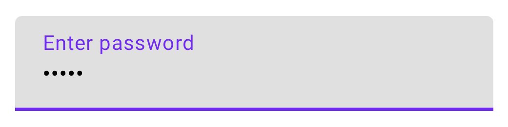
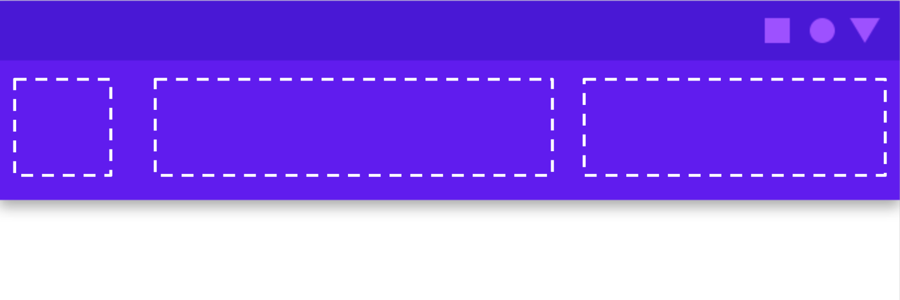

# 2주차
Image, Icon, Checkbox, TextField, Spacer, Divider
Slot Api, Scaffold

# Image
```kotlin
Image(
        painter = painterResource(id = R.drawable.dog),
        contentDescription = stringResource(id = R.string.dog_content_description),
        contentScale = ContentScale.Fit,
        modifier = imageModifier
)
```

## Coil
https://medium.com/@kostadin.georgiev90/android-image-loading-libraries-picasso-vs-glide-vs-coil-90e3fb6c0068

Compose에서는 주로 Coil 이미지 라이브러리를 사용한다.

https://github.com/coil-kt/coil/blob/main/README-ko.md
```kotlin
AsyncImage(
    model = "https://example.com/image.jpg",
    contentDescription = null,
)
```   

# Icon
```kotlin
@Composable
fun Icon(
    painter: Painter,
    contentDescription: String?,
    modifier: Modifier = Modifier,
    tint: Color = LocalContentColor.current.copy(alpha = LocalContentAlpha.current)
)
```

Image와의 차이점은 contentScale이 없는 대신, tint가 존재한다.   

# Checkbox
```kotlin
@Composable
fun Checkbox(
        checked: Boolean,
        onCheckedChange: ((Boolean) -> Unit)?,
        modifier: Modifier = Modifier,
        enabled: Boolean = true,
        interactionSource: MutableInteractionSource = remember { MutableInteractionSource() },
        colors: CheckboxColors = CheckboxDefaults.colors()
): Unit
```   

https://foso.github.io/Jetpack-Compose-Playground/material/checkbox/   

# TextField
## TextField vs BasicTextField
- TextField : 머터리얼 디자인 가이드라인을 따름.
- BasicTextField : 머터리얼에 영향을 받지 않음. 즉 자유롭게 커스텀 가능   

```kotlin
@Composable
fun SimpleFilledTextFieldSample() {
    var text by remember { mutableStateOf("Hello") }

    TextField(
        value = text,
        onValueChange = { text = it },
        label = { Text("Label") }
    )
}
```

## TextField 스타일 지정
- singleLine
- maxLines
- textStyle

```kotlin
@Composable
fun StyledTextField() {
    var value by remember { mutableStateOf("Hello\nWorld\nInvisible") }

    TextField(
        value = value,
        onValueChange = { value = it },
        label = { Text("Enter text") },
        maxLines = 2,
        textStyle = TextStyle(color = Color.Blue, fontWeight = FontWeight.Bold),
        modifier = Modifier.padding(20.dp)
    )
}
```   

## 키보드 옵션
- capitalization
- autoCorrect
- keyboardType
- imeAction   

## 형식 지정
TextField를 사용하면 입력 값에 VisualTransformation을 설정할 수 있습니다. 예를 들어 비밀번호를 나타내는 문자를 * 기호로 바꾸거나 신용카드 번호의 4자리마다 하이픈을 삽입할 수 있습니다.   

```kotlin
@Composable
fun PasswordTextField() {
    var password by rememberSaveable { mutableStateOf("") }

    TextField(
        value = password,
        onValueChange = { password = it },
        label = { Text("Enter password") },
        visualTransformation = PasswordVisualTransformation(),
        keyboardOptions = KeyboardOptions(keyboardType = KeyboardType.Password)
    )
}
```

   

## 입력 정리
앞의 0을 허용하지 않는 텍스트 입력란을 구현하려면 모든 값을 변경할 때 선행 0을 전부 제거하면 됩니다.   
```kotlin
@Composable
fun NoLeadingZeroes() {
  var input by rememberSaveable { mutableStateOf("") }
  TextField(
      value = input,
      onValueChange = { newText ->
          input = newText.trimStart { it == '0' }
      }
  )
}
```


https://developer.android.com/jetpack/compose/text?hl=ko#enter-modify-text
https://sungbin.land/jetpack-compose-%EB%82%98%EB%A7%8C%EC%9D%98-textfield-%EB%A7%8C%EB%93%A4%EA%B8%B0-1d117b37d2a7   

# Spacer
컴포저블 사이에 추가적인 공간을 만들고 싶을 때 사용.
```kotlin
@Composable
fun SpacerDemo() {
    Column {
        Text("Hello")
        Spacer(modifier = Modifier.size(30.dp))
        Text("World")
    }
}

```   

https://foso.github.io/Jetpack-Compose-Playground/foundation/layout/spacer/

# Divider
Divider를 사용하여 선을 그을 수 있다.

```kotlin
@Composable
fun DividerExample(){
    Column {
        Text("Foo")
        Divider(startIndent = 8.dp, thickness = 1.dp, color = Color.Black)
        Text("Bar")
    }
}
```   

https://foso.github.io/Jetpack-Compose-Playground/material/divider/

# Slot Api   
Slot Api을 사용하면 자체적으로 하위 요소를 구성할 수 있으므로 유연성이 향상됩니다.
   

https://developer.android.com/jetpack/compose/layouts/basics?hl=ko#slot-based-layouts

# Scaffold
Scaffold 컴포저블은 Material Design 가이드라인에 따라 앱 구조를 빠르게 조합하는 데 사용할 수 있는 간단한 API를 제공합니다. Scaffold는 여러 컴포저블을 매개변수로 허용합니다. 이 중 일부는 다음과 같습니다.   

- topBar: 화면 상단의 앱 바입니다.
- bottomBar: 화면 하단의 앱 바
- floatingActionButton: 키 작업을 노출하는 데 사용할 수 있는 화면의 오른쪽 하단 위로 마우스를 가져가는 버튼입니다.


```kotlin
@Composable
fun Scaffold(
    modifier: Modifier = Modifier,
    topBar: @Composable () -> Unit = {},
    bottomBar: @Composable () -> Unit = {},
    snackbarHost: @Composable () -> Unit = {},
    floatingActionButton: @Composable () -> Unit = {},
    floatingActionButtonPosition: FabPosition = FabPosition.End,
    containerColor: Color = MaterialTheme.colorScheme.background,
    contentColor: Color = contentColorFor(containerColor),
    contentWindowInsets: WindowInsets = ScaffoldDefaults.contentWindowInsets,
    content: @Composable (PaddingValues) -> Unit
)
```   

https://developer.android.com/jetpack/compose/components/scaffold?hl=ko

