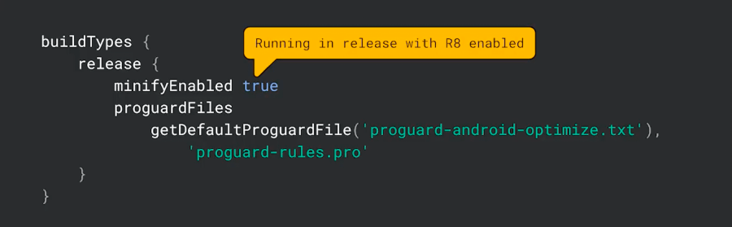

# 3주차
LazyColumn, Dialog, SnackBar

# LazyColumn
Column에 많은 수의 항목을 배치하게 되면 모든 항목이 표시 가능 여부와 관계 없이 구성되고 배치되므로 성능 문제가 발생할 수 있다. (RecyclerView가 아닌 ListView를 사용했을 때의 문제와 동일하다.)   

Compose에서는 RecyclerView와 유사한 LazyColumn과 LazyRow를 제공해준다.   

## LazyListScope DSL
LazyListScope안에서 여러 함수를 사용할 수 있다.
- item : 단일 항목 추가
- items(Int) : 여러 항목 추가
- items(List) : 리스트 추가 가능
- itemsIndexed() : index를 추가로 제공

```kotlin
@Composable
fun MessageList(messages: List<Message>) {
    LazyColumn {
        // Add a single item
        item {
            Text(text = "First item")
        }

        // Add 5 items
        items(5) { index ->
            Text(text = "Item: $index")
        }

        // Add another single item
        item {
            Text(text = "Last item")
        }

        items(messages) { message ->
            MessageRow(message)
        }
    }
}
```

## LazyGrid
컴포즈는 LazyVerticalGird 및 LazyHorizontalGrid을 추가로 제공한다. 또한 LazyListScope와 매우 유사한 LazyGridScope를 제공한다.   

```kotlin
@Composable
fun PhotoGrid(photos: List<Photo>) {
    LazyVerticalGrid(
        columns = GridCells.Adaptive(minSize = 128.dp)
    ) {
        items(photos) { photo ->
            PhotoItem(photo)
        }
    }
}
```   

GridCells.Adaptive를 사용해서 최소 사이즈를 정할 수 있다. 이렇게 최소 사이즈를 설정하면 가능한 많은 열에 항목을 배치한다.   

사용할 열의 정확한 수를 알고 있다면 GridCells.Fixed를 사용할 수 있다.   

```kotlin
LazyVerticalGrid(
        columns = GridCells.Adaptive(minSize = 128.dp),
) {
    items(
            listOf(
                    GridDummy(),
                    GridDummy(true),
                    GridDummy(),
            ),
            span = { gridDummy -> GridItemSpan(if (gridDummy.isSpanDouble) 2 else 1) },
    ) { gridDummy ->
        Text(
                modifier = Modifier.background(if (gridDummy.isSpanDouble) Color.Red else Color.Green),
                text = "${if (gridDummy.isSpanDouble) 2 else 1}"
        )
    }
}

data class GridDummy(
        val isSpanDouble: Boolean = false,
)
```

   

GridItemSpan을 통해서 Span(영역)을 동적으로 지정할 수 있다.   

## ContentPadding
Content 가장자리 주변에 패딩을 추가해야하는 경우 contentPadding을 사용할 수 있다.   

   
Content 주위에 Modifier를 사용하여 padding을 추가하는 경우 **첫 아이템과 마지막 아이템이 스크롤할 때 컨텐츠가 짤린다.**   

   
List에 동일한 Padding을 유지하면서 Content가 잘리지 않게 하는 해결법으로는 List의 contentPadding을 사용하면 된다.   

## Content Space
Content 사이의 간격을 추가하려면 spaceBy()를 사용하면 된다.
    

```kotlin
LazyVerticalGrid(
    columns = GridCells.Fixed(2),
    verticalArrangement = Arrangement.spacedBy(16.dp),
    horizontalArrangement = Arrangement.spacedBy(16.dp)
) {
    items(data) { item ->
        Item(item)
    }
}
```   

그리드는 Column, Row와 다르게 세로 및 가로 Arragment를 모두 허용한다.   

## item key   
key가 없으면 item의 position이 key로 사용됩니다. 따라서 list에 특정 아이템이 추가/삭제되는 경우 해당 아이템 이후의 item들에 대해서는 composition tree개 재생성되어야 하므로 recomposition의 부담이 커집니다. 최악의 경우 맨 위 아이템을 삭제한다거나, 맨 위에 아이템을 추가한다면 모든 item에 대한 composition tree를 다시 생성하게 됩니다.
따라서 구분 가능한 unique한 키를 지정함으로써 item list의 중간값 또는 처음/마지막값 등 어떤 리스트가 삭제/추가되더라도 기존 composition tree를 유지하면서 변경된 item은 tree에 추가/삭제할 수 있습니다.   

```kotlin
@Composable
fun MessageList(messages: List<Message>) {
    LazyColumn {
        items(
            items = messages,
            key = { message ->
                // Return a stable + unique key for the item
                message.id
            }
        ) { message ->
            MessageRow(message)
        }
    }
}
```   

## animation   
recyclerView에 적용되는 기본 애니메이션을 적용하려면 다음과 같이 하면 된다.   
```kotlin
LazyColumn {
    items(books, key = { it.id }) {
        Row(Modifier.animateItemPlacement()) {
            // ...
        }
    }
}
```   
커스텀할 수도 있다.   
```kotlin
LazyColumn {
    items(books, key = { it.id }) {
        Row(Modifier.animateItemPlacement(
            tween(durationMillis = 250)
        )) {
            // ...
        }
    }
}
```   

재정렬 외에 추가 및 삭제를 위한 애니메이션은 개발 중이라 한다.   

## Sticky Header (Experimental)   
   

stickerHeader() 함수를 사용하여 stickerHeader를 구현할 수 있다.   
```kotlin
@OptIn(ExperimentalFoundationApi::class)
@Composable
fun ListWithHeader(items: List<Item>) {
    LazyColumn {
        stickyHeader {
            Header()
        }

        items(items) { item ->
            ItemRow(item)
        }
    }
}
```   

사진처럼 구현하려면 다음과 같이 하면 된다.   
```kotlin
// TODO: This ideally would be done in the ViewModel
val grouped = contacts.groupBy { it.firstName[0] }

@OptIn(ExperimentalFoundationApi::class)
@Composable
fun ContactsList(grouped: Map<Char, List<Contact>>) {
    LazyColumn {
        grouped.forEach { (initial, contactsForInitial) ->
            stickyHeader {
                CharacterHeader(initial)
            }

            items(contactsForInitial) { contact ->
                ContactListItem(contact)
            }
        }
    }
}
```   

## 스크롤 위치에 반응
예를 들어, 첫 번째 아이템이 보여질 때 특정 작업을 하고싶다면 LazyListState를 사용하면 된다.   
사용자가 첫 번째 항목을 지나 스크롤했는지 여부에 따라 버튼을 표시하고 숨기는 예를 사용하는 경우는 다음과 같이 구현할 수 있다. (derivedStateOf는 5주차에서 다룬다.)
```kotlin
@OptIn(ExperimentalAnimationApi::class) // AnimatedVisibility
@Composable
fun MessageList(messages: List<Message>) {
    Box {
        val listState = rememberLazyListState()

        LazyColumn(state = listState) {
            // ...
        }

        // Show the button if the first visible item is past
        // the first item. We use a remembered derived state to
        // minimize unnecessary compositions
        val showButton by remember {
            derivedStateOf {
                listState.firstVisibleItemIndex > 0
            }
        }

        AnimatedVisibility(visible = showButton) {
            ScrollToTopButton()
        }
    }
}
```   

컴포지션에서 이벤트를 처리할 필요가 없는 경우도 있다. 예를 들면 사용자가 특정 지점을 지나 스크롤한 후 분석 이벤트를 보내는 것이다. 이때는 snapshotFlow()를 사용할 수 있다.   
```kotlin
val listState = rememberLazyListState()

LazyColumn(state = listState) {
    // ...
}

LaunchedEffect(listState) {
    snapshotFlow { listState.firstVisibleItemIndex }
        .map { index -> index > 0 }
        .distinctUntilChanged()
        .filter { it == true }
        .collect {
            MyAnalyticsService.sendScrolledPastFirstItemEvent()
        }
}
```   

## 스크롤 위치 제어
scrollToItem() 또는 animateScrollToItem()을 사용하여 스크롤이 가능하다.   
단, 코루틴에서 처리해야 한다. rememberCoroutineScope를 사용하면 된다. rememberCoroutineScope는 코루틴을 만들고 Compose Suspend Api를 호출할 수 있는 CoroutineScope를 반환한다.

```kotlin
@Composable
fun MessageList(messages: List<Message>) {
    val listState = rememberLazyListState()
    // Remember a CoroutineScope to be able to launch
    val coroutineScope = rememberCoroutineScope()

    LazyColumn(state = listState) {
        // ...
    }

    ScrollToTopButton(
        onClick = {
            coroutineScope.launch {
                // Animate scroll to the first item
                listState.animateScrollToItem(index = 0)
            }
        }
    )
}
```   

## 팁
### 크기가 0px인 항목 사용 금지
LazyLayout은 첫 번째 측정에서 눈이 보이는 만큼만 item을 Composition합니다.    
얘를 들어 
- LazyLayout의 크기가 300px
- 자식 아이템의 크기는 50px
- 자식 아이템의 개수는 20개

인 경우 첫 번째 측정에서 6개의 자식 아이템만 배치합니다.   

하지만 
- LazyLayout의 크기가 300px
- 자식 아이템의 크기는 0px
- 자식 아이템의 개수는 20개

인 경우 첫 번째 측정에서 20개의 자식 아이템이 배치됩니다.

### 동일한 방향으로 스크롤 가능한 컴포넌트 중첩 불가   
    
위 사진처럼 구현 불가능   

방향 스크롤이 가능한 다른 부모 안에 미리 정의된 크기가 없는 스크롤 가능한 자식을 중첩하는 경우를 피하라는 말이다.   

기존 View 시스템에서 ScrolView 내부에 RecyclerView를 둘 수 있었기 때문에 혼란스러웠다. 이렇게 정의하면 모든 아이템이 즉시 생성되므로 재활용이 무효화되는 성능에 심각한 영향을 미친다. 그 이유는 이전 0픽셀 크기 아이템에서 언급한 것과 유사하다. (6주차 이후 다룰 예정)   

단, 동일한 방향을 사용하지만, 고정된 크기의 하위 레이아웃 설정은 허용된다.   
   

### 한 아이템에 여러 요소를 넣지 말아야 한다.   
   
예를 들어 Item(1)이 보이는 순간 Item(2)도 Composition이 되어 측정된다. LazyLayout을 사용하는 이유는 눈에 보이는 Item만 Composition하는 것인데, 이러면 LazyLayout의 장점이 사라진다.   

또한 scrollToItem도 정상적으로 동작하지 않는다.   

### Custom arragements   
예를 들어, 사용 가능한 높이를 채울 만큼 아이템이 충분하지 않은 경우 Footer를 하단에 표시해야 할 수 있다. 이를 위해서 Custom Vertical Arrangement를 사용하여 Lazy Column에 전달할 수 있다.   
   

## Performance   
디버그 빌드에서 Lazy Layout 스크롤이 버벅이는건 정상적인 현상일 수도 있다.   
Lazy Layout의 성능을 안정적으로 측정할 수 있는 방법은
1. minifyEnabled true인 릴리즈 빌드
2. baseline profile https://www.youtube.com/watch?v=EOQB8PTLkpY   
이 있다.   

   

### 최적화 - Composition 재사용   
RecyclerView와 비슷하게 스크롤 후 이전에 보이던 아이템이 더 이상 필요하지 않게 되더라도 바로 폐기하지 않는다.   
   

다른 타입의 아이템으로 구성된 List의 경우, Content Type를 제공하면 동일한 Type의 아이템 간에서만 Composition을 재사용한다.   
   
   

### 최적화 - prefetching   
화면에 보이지 않는 다음 아이템이 나타나기 전에 그 아이템을 미리 Compose, Measure 해놓는 방식으로 최적화를 수행한다.   
https://youtu.be/1ANt65eoNhQ?si=bJmy6PVcOnlkf6Dt&t=1330


## 참고

https://pluu.github.io/blog/android/io22/2022/06/19/io22-Lazy-layouts-in-Compose/
https://developer.android.com/jetpack/compose/lists?hl=ko   
https://tourspace.tistory.com/535   

# Dialog

# SnackBar