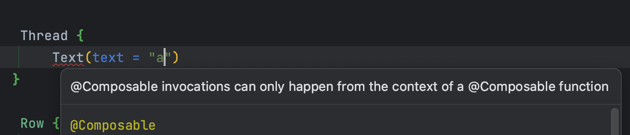

# 4주차
- Compose 이해 (https://developer.android.com/jetpack/compose/mental-model?hl=ko)
- 상태 관리 (https://developer.android.com/jetpack/compose/state?hl=ko)   

## 젯펙 컴포즈란?
> 구글의 모든 운영체제 플팻폼용 앱 개발에 관한 완전히 새로운 접근 방식

다음과 같은 장점이 있다.
1. 앱을 더 쉽고 빠르게 개발하게 한다.
2. 버그에 취약하지 않는 것을 목표로 개발되었다.
3. 거의 실시간으로 컴포즈 프로젝트를 테스트할 수 있다.
4. 선언적인 동시에 데이터 주도적이다.

4번의 *선언적*이라는게 왜 장점일까?   
사실 xml도 선언적이다 ... !    
선언형 프로그래밍은 뭘까?
> 프로그램이 무엇을 해야 할지를 나타내는 경우를 선언형이라고 한다. 예를 들어 컴퓨터 화면에 웹 페이지를 나타낼 때 "어떤 방법"으로 페이지를 나타내야 하는지 보다 제목, 본문, 그림 등과 같이 "무엇"을 화면에 나타내야 할지를 고민하는 것이 선언형 프로그래밍이다.

화면을 디자인할 때는 "어떻게" 보다는 "무엇을"이 더 중요하므로 선언형 프로그래밍이 좋다고 할 수 있다.

그러면 xml도 선언형이고 컴포즈도 선언형인데 ... 둘의 차이점은 뭘까? 같은 선언형이라면 그냥 기존에 있는 xml 사용하면 안되는걸까?


UI를 xml로 그리면, UI 제어는 별개의 kotlin 코드 (Activity.kt, Fragment.kt) 에서 관리를 해야한다.

**시간이 많이 흐른 뒤 view를 수정하고 싶어서 xml을 수정하게 되면, 어쩔 수 없이 kotlin 코드도 수정해야 하며, 이때 하나라도 놓치면 런타임 에러가 나게 됩니다.**

MVVM과 databinding을 사용하면서 어느 정도는 동적인 UI 제어가 가능해졌지만 ... 이는 특정 view의 attribute를 동적으로 바꾸기 쉬울 뿐, UI 그룹들 (Constraint 안의 그룹들)을 동적으로 바꾸기에는 적합하지 않습니다. UI 그룹들을 Fragment로 교체하는 방법이 있지만 이 방법은 귀찮은 작업이며 생명 주기까지 고려해야합니다.

[출처 : 쾌락코딩](https://wooooooak.github.io/jetpack%20compose/2021/05/18/%EC%BB%B4%ED%8F%AC%EC%A6%88%EA%B0%80%ED%95%84%EC%9A%94%ED%95%9C%EC%9D%B4%EC%9C%A0/)

하지만 컴포즈를 사용한다면 xml을 사용하여 복잡한 세부 사항을 직접 디자인 하지 않고도, 간단하고 직관적인 구문을 이용해 씬을 기술할 수 있습니다. 또한 소규모의 재사용 가능한 커스텀 서브 뷰를 조합함으로써 복잡한 뷰를 쉽게 만들 수 있습니다.

*데이터 주도적*은 또 무슨 소리일까 ... ?   
컴포즈는 데이터를 상태로서 저장하고 해당 데이터가 변경되면 변경사항이 사용자 인터페이스에 자동으로 반영된다. 기존에는 사용자 인터페이스가 항상 최신 데이터 상태를 반영하도록 코드를 작성해야 했음 (데이터의 변경을 감지하는 코드를 따로 작성하고 데이터 변경에 따라 사용자 인터페이스를 변경해주는 코드를 또 따로 작성.)

컴포즈의 경우, 앱 코드 안의 어디에서든 상태가 변경되면, 해당 데이터를 구독하는 컴포넌트가 삭제되고 새로운 컴포넌트가 생성되어 상태를 반영. 이를 **재구성(recomposition)**이라 부른다.   

## 재구성(recomposition)   
Compose에서는 갱신된 데이터를 사용해서 Composable를 다시 호출합니다. 이렇게 하면 Composable 함수가 recomposition되며, 필요한 경우 함수에서 내보낸 위젯이 갱신된 데이터로 다시 그려집니다. **Compose는 변경된 Component만 지능적으로 recomposition할 수 있습니다.**   

Compose는 recomposition할 때 변경되었을 수 있는 함수 또는 람다만 호출하고 나머지는 건너뜁니다. 매개변수가 변경되지 않은 함수 또는 람다를 모두 건너뜀으로써 Compose 재구성이 효율적으로 이루어질 수 있습니다.   

Composable 함수의 recomposition은 skip될 수 있습니다. 따라서 Composable 함수의 side-effect에 의존해서는 안됩니다. (skip되면 side-effect가 발생하지 않으므로)   

side-effect는 앱의 나머지 부분에 표시되는 변경사항입니다. 
- 공유 객체의 프로퍼티 쓰기
- ViewModel안의 observable 업데이트
- shared preferences 업데이트   

-> Composable 함수 내에서 side-effect를 발생시키는건 좋지 않다.   

### Composable 함수는 순서와 관계없이 실행될 수 있음   
Compose에는 일부 UI 요소가 다른 UI 요소보다 우선순위가 높다는 것을 인식하고 그 요소를 먼저 그리는 옵션이 있습니다.   

### Composable 함수는 동시에 실행할 수 있음
공식 문서에는 다음과 같이 적혀있다.
> Compose는 Composable함수를 동시에 실행하여 recomposition을 최적화할 수 있습니다.
이 최적화는 composable함수가 백그라운드 스레드 풀 내에서 실행될 수 있음을 의미합니다. Compose는 동시에 여러 스레드에서 composable함수를 호출할 수 있습니다.   
 
   

엥? 스레드에서 Composable 함수 호출 못하는데???

[Compose에서는 백그라운드 쓰레드에서의 UI업데이트가 자유롭다.](https://velog.io/@cksgodl/Android-Thread%EC%99%80-Runnable-%EA%B7%B8%EB%A6%AC%EA%B3%A0-Looper)를 보고 공식문서에 적힌 내용이 뭘 의미하는지 이해했다.

compose에서는 state가 변경될 때 recomposition이 일어난다. 여러 스레드에서 해당 state를 변경하게 된다면 recomposition(composable 함수 호출)은 일어날 것이며 뷰 업데이트는 가능할 것이다.


```kotlin
Row {
    Column {
        Button(onClick = {
            val thread = Thread {
                Log.i("MainACtivity-Thraed-1", Thread.currentThread().name)
                for (i in 0..100) {
                    Thread.sleep(1000)
                    text = i.toString()
                }
            }
            thread.start()
        }) {
            Text(text = "Start Thread_1")
        }
    }
    Button(onClick = {
        val thread = Thread {
            Log.i("MainACtivity-Thraed-2", Thread.currentThread().name)
            for (i in 100..200) {
                Thread.sleep(1000)
                text = i.toString()
            }
        }
        thread.start()
    }) {
        Text(text = "Start Thread_2")
    }
}
Text(text = text)
```   

text가 recomposition이 발생하는 state이다.   
text는 여러 스레드에서 변경이 이루어진다.   
text가 변경되면 리컴포지션(composable 함수가 호출)된다.   
즉 여러 스레드에서 리컴포지션(Composable 함수를 호출)을 발생시킬 수 있다.   
-> Composable 함수는 동시에 실행될 수 있다.   

아래 코드는 위험하다.
```kotlin
@Composable
@Deprecated("Example with bug")
fun ListWithBug(myList: List<String>) {
    var items = 0

    Row(horizontalArrangement = Arrangement.SpaceBetween) {
        Column {
            for (item in myList) {
                Text("Item: $item")
                items++ // Avoid! Side-effect of the column recomposing.
            }
        }
        Text("Count: $items")
    }
}
```   

이 예에서 items는 매 recomposition 마다 수정이 발생한다. 따라서 올바른 items의 개수를 표현하지 못하게 된다. Compose에서 이런 방식은 금지가 되어있다.   

### recomposition은 가능한 한 많이 건너뜀
```kotlin
/**
 * Display a list of names the user can click with a header
 */
@Composable
fun NamePicker(
    header: String,
    names: List<String>,
    onNameClicked: (String) -> Unit
) {
    Column {
        // this will recompose when [header] changes, but not when [names] changes
        Text(header, style = MaterialTheme.typography.h5)
        Divider()

        // LazyColumn is the Compose version of a RecyclerView.
        // The lambda passed to items() is similar to a RecyclerView.ViewHolder.
        LazyColumn {
            items(names) { name ->
                // When an item's [name] updates, the adapter for that item
                // will recompose. This will not recompose when [header] changes
                NamePickerItem(name, onNameClicked)
            }
        }
    }
}

/**
 * Display a single name the user can click.
 */
@Composable
private fun NamePickerItem(name: String, onClicked: (String) -> Unit) {
    Text(name, Modifier.clickable(onClick = { onClicked(name) }))
}
```   

### Recomposition은 낙관적임   
Recomposition은 Compose가 컴포저블의 매개변수가 변경되었을 수 있다고 생각할 때마다 시작된다. Recomposition은 낙관적이다. 즉, Compose는 매개변수가 다시 변경되기 전에 Recomposition을 완료할 것으로 예상한다. Recomposition이 완료되기 전에 매개변수가 변경되면 Compose는 Recomposition을 취소하고 새 매개변수를 사용하여 Composition을 다시 시작할 수 있다.

Recomposition이 취소되면 Compose는 Recomposition에서 UI 트리를 삭제한다. 표시되는 UI에 종속되는 부수효과가 있다면 Recomposition이 취소된 경우에도 부수효과가 적용된다. 이로 인해 일관되지 않은 앱 상태가 발생할 수 있다.

낙관적 Recomposition을 처리할 수 있도록 모든 컴포저블 함수 및 람다가 멱등성이고 부수효과가 없는지 확인해야 한다.   

### 구성 가능한 함수는 매우 자주 실행될 수 있음.   
경우에 따라 구성 가능한 함수는 UI 애니메이션의 모든 프레임에서 실행될 수 있습니다. 함수가 기기 저장소에서 읽기와 같이 비용이 많이 드는 작업을 실행하면 이 함수로 인해 UI 버벅거림이 발생할 수 있습니다.

예를 들어 위젯이 기기 설정을 읽으려고 하면 잠재적으로 이 설정을 초당 수백 번 읽을 수 있으며 이는 앱 성능에 치명적인 영향을 줄 수 있습니다.

구성 가능한 함수에 데이터가 필요하다면 데이터의 매개변수를 정의해야 합니다. 그런 다음, 비용이 많이 드는 작업을 구성 외부의 다른 스레드로 이동하고 mutableStateOf 또는 LiveData를 사용하여 Compose에 데이터를 전달할 수 있습니다.   

## 상태 관리

