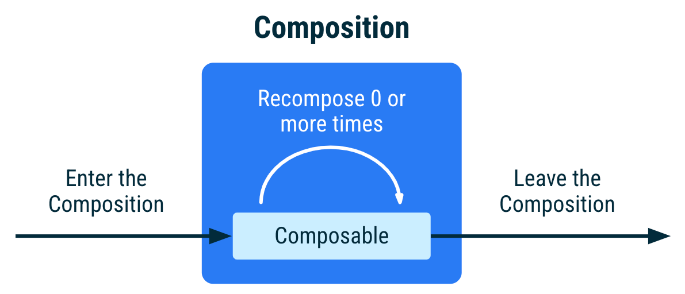
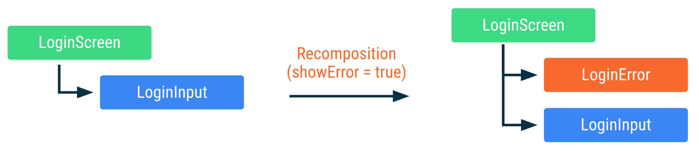
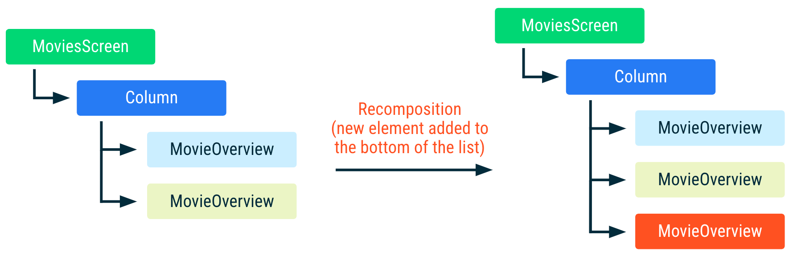

# 5주차
- 수명 주기 (https://developer.android.com/jetpack/compose/lifecycle?hl=ko)
- 부수 효과 (https://developer.android.com/jetpack/compose/side-effects?hl=ko)

# 수명 주기
## 개요
컴포지션은 UI를 기술하는 컴포저블의 트리 구조이다.   
컴포지션은 초기 컴포지션을 통해서만 생성되고 리컴포지션을 통해서만 업데이트 된다.   

   

컴포저블의 수명 주기
1. 컴포지션 시작
2. 리컴포지션
3. 컴포지션 종료   

리컴포지션은 일반적으로 `State<T>` 객체가 변경되면 트리거됩니다.   

## 컴포지션 내 컴포저블의 분석
컴포지션 내 컴포저블의 인스턴스는 호출 사이트(call site)로 식별된다. (호출 사이트는 컴포저블이 호출되는 소스코드 위치이다. 호출 사이트는 컴포지션 내 위치와 UI 트리에 영향을 미친다.)   

여러 호출 사이트에서 컴포저블을 호출하면 컴포지션에 컴포저블의 여러 인스턴스가 생성된다.   

Compose는 호출되거나 호출되지 않은 컴포저블을 식별하며 두 컴포지션 모두에서 호출된 컴포저블의 경우 입력이 변경되지 않은 경우 재구성하지 않습니다.   

```kotlin
@Composable
fun LoginScreen(showError: Boolean) {
    if (showError) {
        LoginError()
    }
    LoginInput() // This call site affects where LoginInput is placed in Composition
}

@Composable
fun LoginInput() { /* ... */ }
```   
   

LoginInput이 2번 호출되었지만 LoginInput 인스턴스는 유지됩니다.   

## 스마트 리컴포지션에 도움이 되는 정보 추가
```kotlin
@Composable
fun MoviesScreen(movies: List<Movie>) {
    Column {
        for (movie in movies) {
            // MovieOverview composables are placed in Composition given its
            // index position in the for loop
            MovieOverview(movie)
        }
    }
}
```   

위 예에서 Compose는 호출 사이트 외에 실행 순서를 사용해서 컴포지션에서 인스턴스를 구분한다. 새 `movie`가 하단에 추가되면 Compose는 인스턴스의 목록 내 위치가 변경되지 않았고 따라서 인스턴스의 `movie` 입력이 동일하므로 컴포지션에 이미 있는 인스턴스를 재사용할 수 있다.   

   
`MovieOverview`의 색상이 동일하면 컴포저블이 재구성되지 않았음을 의미  

하지만 Column의 상단 또는 가운데에 항목을 추가하거나 항목을 삭제하거나 재정렬하는 경우 모든 `MovieOverview`에서 리컴포지션이 발생한다. 예를 들어 영화 이미지를 네트워크에서 가져오는 경우, 리컴포지션이 발생하면 취소되고 다시 시작된다.   

```kotlin
@Composable
fun MovieOverview(movie: Movie) {
    Column {
        // Side effect explained later in the docs. If MovieOverview
        // recomposes, while fetching the image is in progress,
        // it is cancelled and restarted.
        val image = loadNetworkImage(movie.url)
        MovieHeader(image)

        /* ... */
    }
}
```   

   
`MovieOverview`의 색상이 다르면 컴포저블이 재구성되었음을 의미.   

아래와 같이 key를 별도로 지정해주면 위 현상을 방지할 수 있다.   
```kotlin
@Composable
fun MoviesScreen(movies: List<Movie>) {
    Column {
        for (movie in movies) {
            key(movie.id) { // Unique ID for this movie
                MovieOverview(movie)
            }
        }
    }
}
```   

## 입력이 변경되지 않은 경우 건너뛰기
컴포지션에 이미 컴포저블이 있는 경우, 모든 입력이 stable하고 변경되지 않았으면 리컴포지션을 건너뛸 수 있다.   

stable type은 다음을 따라야한다.
- 두 인스턴스의 `equals` 결과가 동일한 두 인스턴스의 경우 항상 동일하다.
- type의 public property가 변경되면 컴포지션에 알림이 간다.
- 모든 public property도 stable하다.
`@Stable`을 사용하여 명시하지 않아도 Compose가 stable하다고 간주한다. 
또한 stable하다고 간주하는 일반 유형이 있다.   
- 모든 원시 값 유형 : `Boolean`, `Int`, `Long` ...
- 문자열
- 모든 함수 유형(람다)

변경할 수 없는 유형은 절대 변경되지 않으므로 컴포지션에 변경사항을 알리지 않아도 된다.   

```kotlin
// 유일한 필드인 value 가 안정 상태이고 불변하기 때문에 Name 클래스는 안정 상태로 판단된다.
class Name(val value: String)
```   

예를 들어 위 코드에서 Name 클래스는 모든 필드가 불변하고 안정한 타입 이므로 안정적 상태로 간주된다. [참고한 링크](https://sungbin.land/a-deep-dive-into-jetpack-compose-stability-38b5b109da71)     


type의 public property가 변경되면 컴포지션에 알림이 간다. -> Compose의 `MutableState`유형으로 생각하면 된다. `Mutablestate`의 경우 `State`의 `.value`값이 변경되면 Compose에 알림이 전송되므로 상태 객체는 전체적으로 안정적인 것으로 간주된다.   

Compose는 증명할 수 있는 경우에만 유형을 stable한 것으로 간주한다. 예를 들어 interface, 구현을 변경할 수 없는데 변경할 수 있는 public property가 있는 유형은 stable 하지 않다.   

Compose가 type이 stable이라고 추론할 수 없지만 stable으로 간주하도록 하려면 `@Stable` 주석을 사용해라.   

```kotlin
// Marking the type as stable to favor skipping and smart recompositions.
@Stable
interface UiState<T : Result<T>> {
    val value: T?
    val exception: Throwable?

    val hasError: Boolean
        get() = exception != null
}
```   

# 부수 효과
부수 효과는 Composable 함수의 범위 밖에서 발생하는 앱 상태에 대한 변경사항이다. 스낵바를 표시하거나 다른 화면으로 이동하는 등 일회성 이벤트를 트리거할 때 필요합니다.   

## State 및 Effect 사용 사례   
효과(Effect)는 UI를 내보내지 않으며 컴포지션이 완료될 때 부수 효과를 실행하는 Composable 함수이다.

### LaunchedEffect: 컴포저블 범위에서 suspend 함수 실행   
LaunchedEffect가 컴포지션을 시작하면 코루틴이 시작되고 LaunchedEffect가 컴포지션을 종료하면 코루틴이 취소된다. LaunchedEffect가 다른 키로 재구성되면 기존 코루틴이 취소되고 새 코루틴에서 새 suspend 함수가 실행된다.   

```kotlin
@Composable
fun MyScreen(
    state: UiState<List<Movie>>,
    scaffoldState: ScaffoldState = rememberScaffoldState()
) {

    // If the UI state contains an error, show snackbar
    if (state.hasError) {

        // `LaunchedEffect` will cancel and re-launch if
        // `scaffoldState.snackbarHostState` changes
        LaunchedEffect(scaffoldState.snackbarHostState) {
            // Show snackbar using a coroutine, when the coroutine is cancelled the
            // snackbar will automatically dismiss. This coroutine will cancel whenever
            // `state.hasError` is false, and only start when `state.hasError` is true
            // (due to the above if-check), or if `scaffoldState.snackbarHostState` changes.
            scaffoldState.snackbarHostState.showSnackbar(
                message = "Error message",
                actionLabel = "Retry message"
            )
        }
    }

    Scaffold(scaffoldState = scaffoldState) {
        /* ... */
    }
}
```   

state.hasError가 false이면 코루틴이 취소된다.   

### rememberCoroutineScope: 컴포지션 인식 범위를 확보하여 컴포저블 외부에서 코루틴 실행   
LaunchedEffect는 Composable 함수 내에서만 사용할 수 있다. 만약 Composable이 아닌 함수에서 컴포지션이 종료된 후 자동으로 취소되도록 범위가 지정된 코루틴을 실행하려면 rememberCoroutineScope를 사용하면 된다.   

```kotlin
@Composable
fun MoviesScreen(scaffoldState: ScaffoldState = rememberScaffoldState()) {

    // Creates a CoroutineScope bound to the MoviesScreen's lifecycle
    val scope = rememberCoroutineScope()

    Scaffold(scaffoldState = scaffoldState) {
        Column {
            /* ... */
            Button(
                onClick = {
                    // Create a new coroutine in the event handler to show a snackbar
                    scope.launch {
                        scaffoldState.snackbarHostState.showSnackbar("Something happened!")
                    }
                }
            ) {
                Text("Press me")
            }
        }
    }
}
```   

### rememberUpdatedState: 값이 변경되는 경우 다시 시작되지 않아야 하는 효과에서 값 참조   
구글 공식 문서의 내용이 빈약해서 이해가 잘 가지 않더라구요 ... 구글링하던 도중 코드랩에 같은 예시가 있는걸 발견했습니다. 하지만 ... 코드랩에서도 말로만 설명하고 구체적인 예시는 없어서 ... 직접 만들어봤습니다.   

```kotlin
@Composable
private fun MainScreen(onExploreItemClicked: OnExploreItemClicked) {
    Surface(color = MaterialTheme.colors.primary) {
        var showLandingScreen by remember {
            mutableStateOf(true)
        }

        var onTimeOut: () -> Unit by remember {
            mutableStateOf({ showLandingScreen = true })
        }

        if (showLandingScreen) {
            SplashScreen(onTimeout = onTimeOut)

            LaunchedEffect(key1 = true) {
                delay(500L)
                onTimeOut = { showLandingScreen = false }
            }
        } else {
            CraneHome(onExploreItemClicked = onExploreItemClicked)
        }
    }
}

private const val SplashWaitTime: Long = 2000

@Composable
fun SplashScreen(onTimeout: () -> Unit, modifier: Modifier = Modifier) {
    Box(modifier = modifier.fillMaxSize(), contentAlignment = Alignment.Center) {
        // Adds composition consistency. Use the value when LaunchedEffect is first called

        LaunchedEffect(Unit) {
            delay(SplashWaitTime)
            onTimeout()
        }
        Image(painterResource(id = R.drawable.ic_crane_drawer), contentDescription = null)
    }
}
```   

<br>
<br>

***Question!! 2초 후에 보여질 화면은 SplashScreen일까요? CraneHome일까요?***   

<br>
<br>
<br>
<br>
<br>
<br>
<br>
<br>

동작 순서는 다음과 같다.
1. MainScreen - SplashScreen(onTimeOut) 실행 - onTimeOut = { showLandingScreen = true }
2. SplashScreen 2초간 대기 중 ... 
3. 0.5초 이후 MainScreen - onTimeOut 변경 { showLandingScreen = true } -> { showLandingScreen = false }
4. MainScreen - SplashScreen(onTimeOut) 리컴포지션 - onTimeOut = { showLandingScreen = false }
5. 2초가 지나 SpalshScreen의 onTimeout이 실행되고 showLandingScreen이 false가 되어 SpalshScreen이 보이면 안되지만 여전히 보이는 문제 발생

왜 showLandingScreen의 값이 false가 되지 않았을까? 그 이유는 LaunchedEffect는 리컴포지션이 일어나도 재실행되지 않으며 오직 key가 바뀐 경우에만 재실행되기 때문이다.   
따라서 onTimeout이 0.5초 이후 값이 바뀌더라도 LaunchedEffect안의 onTimeout은 바뀌기 전의 값이 있는 것이다.   

이를 해결하려면 onTimeout을 참조로 만들면 된다.   

```kotlin
data class Refer(
    var onTimeout: () -> Unit,
)

val refer = Refer {}

@Composable
fun SplashScreen(onTimeout: () -> Unit, modifier: Modifier = Modifier) {
    Box(modifier = modifier.fillMaxSize(), contentAlignment = Alignment.Center) {
        // Adds composition consistency. Use the value when LaunchedEffect is first called
        refer.onTimeout = onTimeout

        LaunchedEffect(Unit) {
            delay(SplashWaitTime)
            refer.onTimeout()
        }

        Image(painterResource(id = R.drawable.ic_crane_drawer), contentDescription = null)
    }
}
```   

위와 같이 onTimeout을 가지고 있는 객체를 SplashScreen 밖에 선언해두고 LaunchedEffect 내부에서는 해당 객체의 onTimeout을 실행하면 된다.   

그러면 `remember`를 활용하면 어떨까?   
```kotlin
@Composable
inline fun <T> remember(crossinline calculation: @DisallowComposableCalls () -> T): T =
    currentComposer.cache(false, calculation)
```   

remember 구현은 위와 같이 되어있고 ...

```kotlin
@ComposeCompilerApi
inline fun <T> Composer.cache(invalid: Boolean, block: @DisallowComposableCalls () -> T): T {
    @Suppress("UNCHECKED_CAST")
    return rememberedValue().let {
        if (invalid || it === Composer.Empty) {
            val value = block()
            updateRememberedValue(value)
            value
        } else it
    } as T
}
```   

Composer.cache 구현은 위와 같다.   

그러니까 remember {  } 블록의 값을 cache 해놓는다는 것이다.   

onTimeout을 캐시해서 사용하는 것과 참조해서 사용하는 것 둘다 동일한 동작을 할 것으로 예상된다.   

```kotlin
@Composable
fun SplashScreen(onTimeout: () -> Unit, modifier: Modifier = Modifier) {
    Box(modifier = modifier.fillMaxSize(), contentAlignment = Alignment.Center) {
        // Adds composition consistency. Use the value when LaunchedEffect is first called
        // 정상 동작
        val currentOnTimeout by remember { mutableStateOf(onTimeout) }

        LaunchedEffect(Unit) {
            delay(SplashWaitTime)
            currentOnTimeout()
        }

        Image(painterResource(id = R.drawable.ic_crane_drawer), contentDescription = null)
    }
}
```   

하지만 ... 정상 작동하지 않는다.   

왜냐하면 remember는 **초기** 컴포지션이 발생할 때에만 값을 계산하기 때문이다. 
> Composable functions can use the remember API to store an object in memory. A value computed by remember is stored in the Composition during initial composition, and the stored value is returned during recomposition. remember can be used to store both mutable and immutable objects.
   
[공식 문서](https://developer.android.com/jetpack/compose/state#state-in-composables)   

그러니까 초기 컴포지션에서 { showLandingScreen = true } 값은 계산되지만 recomposition때 들어온 { showLandingScreen = false } 값은 remember에 저장되지 않기 때문이다.   
이를 해결하려면 rememberUpdatedState를 사용해야한다. 코드는 아래와 같다.   

```kotlin
@Composable
fun <T> rememberUpdatedState(newValue: T): State<T> = remember {
    mutableStateOf(newValue)
}.apply { value = newValue }
```   

리컴포지션때 새로운 값이 들어와도 remember가 이를 저장하도록 .apply { value = newValue } 를 사용한 것이다.   

최종 해결 코드는 아래와 같다.   
```kotlin
@Composable
fun SplashScreen(onTimeout: () -> Unit, modifier: Modifier = Modifier) {
    Box(modifier = modifier.fillMaxSize(), contentAlignment = Alignment.Center) {
        // Adds composition consistency. Use the value when LaunchedEffect is first called
        val currentOnTimeout by rememberUpdatedState(onTimeout)

        LaunchedEffect(Unit) {
            delay(SplashWaitTime)
            currentOnTimeout()
        }

        Image(painterResource(id = R.drawable.ic_crane_drawer), contentDescription = null)
    }
}
```   

### DisposableEffect 정리가 필요한 효과   
키가 변경되거나 컴포저블이 컴포지션을 종료한 후 onDispose 블록을 실행한다.   
```kotlin
@Composable
fun HomeScreen(
    lifecycleOwner: LifecycleOwner = LocalLifecycleOwner.current,
    onStart: () -> Unit, // Send the 'started' analytics event
    onStop: () -> Unit // Send the 'stopped' analytics event
) {
    // Safely update the current lambdas when a new one is provided
    val currentOnStart by rememberUpdatedState(onStart)
    val currentOnStop by rememberUpdatedState(onStop)

    // If `lifecycleOwner` changes, dispose and reset the effect
    DisposableEffect(lifecycleOwner) {
        // Create an observer that triggers our remembered callbacks
        // for sending analytics events
        val observer = LifecycleEventObserver { _, event ->
            if (event == Lifecycle.Event.ON_START) {
                currentOnStart()
            } else if (event == Lifecycle.Event.ON_STOP) {
                currentOnStop()
            }
        }

        // Add the observer to the lifecycle
        lifecycleOwner.lifecycle.addObserver(observer)

        // When the effect leaves the Composition, remove the observer
        onDispose {
            lifecycleOwner.lifecycle.removeObserver(observer)
        }
    }

    /* Home screen content */
}
```   

### SideEffect: Compose 상태를 비 Compose 코드에 게시   
SideEffect는 컴포지션이 완료되었을 때 실행된다. 하지만 리컴포지션이 일어날 때마다 수행된다는 단점이 있다. 리컴포지션이 일어날 때마다 수행할 작업이 있다면 그때 사용한다.   

```kotlin
@Composable
fun rememberAnalytics(user: User): FirebaseAnalytics {
    val analytics: FirebaseAnalytics = remember {
        /* ... */
    }

    // On every successful composition, update FirebaseAnalytics with
    // the userType from the current User, ensuring that future analytics
    // events have this metadata attached
    SideEffect {
        analytics.setUserProperty("userType", user.userType)
    }
    return analytics
}
```   

예를 들어, User 객체가 바뀌면 FirebaseAnalytics의 setUserProperty를 실행해야할 때 사용할 수 있다.   

### produceState: 비 Compose 상태를 Compose 상태로 변환   
produceState가 컴포지션을 시작하면 프로듀서가 실행되고 컴포지션을 종료하면 취소된다.

```kotlin
@Composable
fun loadNetworkImage(
    url: String,
    imageRepository: ImageRepository
): State<Result<Image>> {

    // Creates a State<T> with Result.Loading as initial value
    // If either `url` or `imageRepository` changes, the running producer
    // will cancel and will be re-launched with the new inputs.
    return produceState<Result<Image>>(initialValue = Result.Loading, url, imageRepository) {

        // In a coroutine, can make suspend calls
        val image = imageRepository.load(url)

        // Update State with either an Error or Success result.
        // This will trigger a recomposition where this State is read
        value = if (image == null) {
            Result.Error
        } else {
            Result.Success(image)
        }
    }
}
```   

### derivedStateOf: 하나 이상의 상태 객체를 다른 상태로 변환
derivedStateOf를 사용하면 계산에서 사용되는 상태 중 하나가 변경될 때만 계산이 실행된다.   

```kotlin
@Composable
fun TodoList(highPriorityKeywords: List<String> = listOf("Review", "Unblock", "Compose")) {

    val todoTasks = remember { mutableStateListOf<String>() }

    // Calculate high priority tasks only when the todoTasks or highPriorityKeywords
    // change, not on every recomposition
    val highPriorityTasks by remember(highPriorityKeywords) {
        derivedStateOf { todoTasks.filter { it.containsWord(highPriorityKeywords) } }
    }

    Box(Modifier.fillMaxSize()) {
        LazyColumn {
            items(highPriorityTasks) { /* ... */ }
            items(todoTasks) { /* ... */ }
        }
        /* Rest of the UI where users can add elements to the list */
    }
}
```   

### snapshotFlow: Compose의 상태를 Flow로 변환
```kotlin
val listState = rememberLazyListState()

LazyColumn(state = listState) {
    // ...
}

LaunchedEffect(listState) {
    snapshotFlow { listState.firstVisibleItemIndex }
        .map { index -> index > 0 }
        .distinctUntilChanged()
        .filter { it == true }
        .collect {
            MyAnalyticsService.sendScrolledPastFirstItemEvent()
        }
}
```


