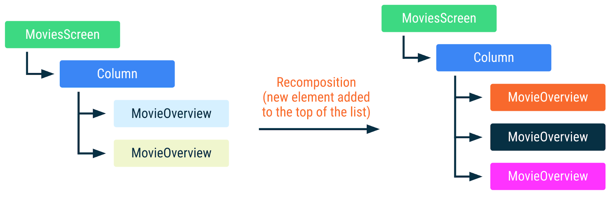

# 5주차
- 수명 주기 (https://developer.android.com/jetpack/compose/lifecycle?hl=ko)
- 부수 효과 (https://developer.android.com/jetpack/compose/side-effects?hl=ko)

# 수명 주기
## 개요
컴포지션은 UI를 기술하는 컴포저블의 트리 구조이다.   
컴포지션은 초기 컴포지션을 통해서만 생성되고 리컴포지션을 통해서만 업데이트 된다.   

   

컴포저블의 수명 주기
1. 컴포지션 시작
2. 리컴포지션
3. 컴포지션 종료   

리컴포지션은 일반적으로 `State<T>` 객체가 변경되면 트리거됩니다.   

## 컴포지션 내 컴포저블의 분석
컴포지션 내 컴포저블의 인스턴스는 호출 사이트(call site)로 식별된다. (호출 사이트는 컴포저블이 호출되는 소스코드 위치이다. 호출 사이트는 컴포지션 내 위치와 UI 트리에 영향을 미친다.)   

여러 호출 사이트에서 컴포저블을 호출하면 컴포지션에 컴포저블의 여러 인스턴스가 생성된다.   

Compose는 호출되거나 호출되지 않은 컴포저블을 식별하며 두 컴포지션 모두에서 호출된 컴포저블의 경우 입력이 변경되지 않은 경우 재구성하지 않습니다.   

```kotlin
@Composable
fun LoginScreen(showError: Boolean) {
    if (showError) {
        LoginError()
    }
    LoginInput() // This call site affects where LoginInput is placed in Composition
}

@Composable
fun LoginInput() { /* ... */ }
```   
   

LoginInput이 2번 호출되었지만 LoginInput 인스턴스는 유지됩니다.   

## 스마트 리컴포지션에 도움이 되는 정보 추가
```kotlin
@Composable
fun MoviesScreen(movies: List<Movie>) {
    Column {
        for (movie in movies) {
            // MovieOverview composables are placed in Composition given its
            // index position in the for loop
            MovieOverview(movie)
        }
    }
}
```   

위 예에서 Compose는 호출 사이트 외에 실행 순서를 사용해서 컴포지션에서 인스턴스를 구분한다. 새 `movie`가 하단에 추가되면 Compose는 인스턴스의 목록 내 위치가 변경되지 않았고 따라서 인스턴스의 `movie` 입력이 동일하므로 컴포지션에 이미 있는 인스턴스를 재사용할 수 있다.   

   
`MovieOverview`의 색상이 동일하면 컴포저블이 재구성되지 않았음을 의미  

하지만 Column의 상단 또는 가운데에 항목을 추가하거나 항목을 삭제하거나 재정렬하는 경우 모든 `MovieOverview`에서 리컴포지션이 발생한다. 예를 들어 영화 이미지를 네트워크에서 가져오는 경우, 리컴포지션이 발생하면 취소되고 다시 시작된다.   

```kotlin
@Composable
fun MovieOverview(movie: Movie) {
    Column {
        // Side effect explained later in the docs. If MovieOverview
        // recomposes, while fetching the image is in progress,
        // it is cancelled and restarted.
        val image = loadNetworkImage(movie.url)
        MovieHeader(image)

        /* ... */
    }
}
```   

   
`MovieOverview`의 색상이 다르면 컴포저블이 재구성되었음을 의미.   

아래와 같이 key를 별도로 지정해주면 위 현상을 방지할 수 있다.   
```kotlin
@Composable
fun MoviesScreen(movies: List<Movie>) {
    Column {
        for (movie in movies) {
            key(movie.id) { // Unique ID for this movie
                MovieOverview(movie)
            }
        }
    }
}
```   

## 입력이 변경되지 않은 경우 건너뛰기
컴포지션에 이미 컴포저블이 있는 경우, 모든 입력이 stable하고 변경되지 않았으면 리컴포지션을 건너뛸 수 있다.   

stable type은 다음을 따라야한다.
- 두 인스턴스의 `equals` 결과가 동일한 두 인스턴스의 경우 항상 동일하다.
- type의 public property가 변경되면 컴포지션에 알림이 간다.
- 모든 public property도 stable하다.
`@Stable`을 사용하여 명시하지 않아도 Compose가 stable하다고 간주한다. 
또한 stable하다고 간주하는 일반 유형이 있다.   
- 모든 원시 값 유형 : `Boolean`, `Int`, `Long` ...
- 문자열
- 모든 함수 유형(람다)

변경할 수 없는 유형은 절대 변경되지 않으므로 컴포지션에 변경사항을 알리지 않아도 된다.   

```kotlin
// 유일한 필드인 value 가 안정 상태이고 불변하기 때문에 Name 클래스는 안정 상태로 판단된다.
class Name(val value: String)
```   

예를 들어 위 코드에서 Name 클래스는 모든 필드가 불변하고 안정한 타입 이므로 안정적 상태로 간주된다. [참고한 링크](https://sungbin.land/a-deep-dive-into-jetpack-compose-stability-38b5b109da71)     


type의 public property가 변경되면 컴포지션에 알림이 간다. -> Compose의 `MutableState`유형으로 생각하면 된다. `Mutablestate`의 경우 `State`의 `.value`값이 변경되면 Compose에 알림이 전송되므로 상태 객체는 전체적으로 안정적인 것으로 간주된다.   

Compose는 증명할 수 있는 경우에만 유형을 stable한 것으로 간주한다. 예를 들어 interface, 구현을 변경할 수 없는데 변경할 수 있는 public property가 있는 유형은 stable 하지 않다.   

Compose가 type이 stable이라고 추론할 수 없지만 stable으로 간주하도록 하려면 `@Stable` 주석을 사용해라.   

```kotlin
// Marking the type as stable to favor skipping and smart recompositions.
@Stable
interface UiState<T : Result<T>> {
    val value: T?
    val exception: Throwable?

    val hasError: Boolean
        get() = exception != null
}
```


