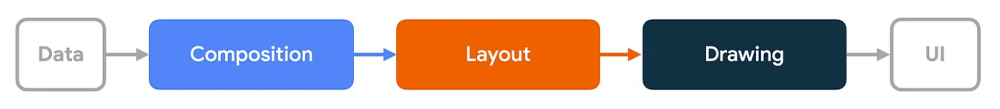
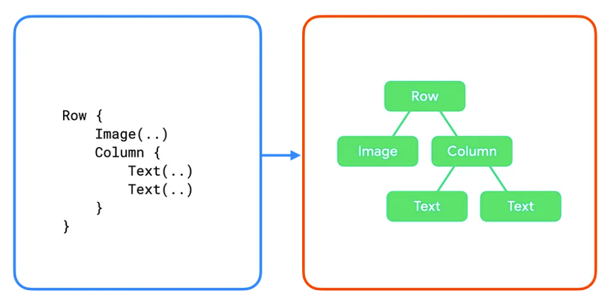
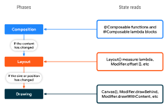

# 5주차
- 단계 (https://developer.android.com/jetpack/compose/phases?hl=ko)
- 성능 (https://developer.android.com/jetpack/compose/performance?hl=ko)

# 단계
컴포즈는 프레임을 여러 특정 페이즈를 통해 렌더링한다.   

## 프레임의 3 페이즈
컴포즈에서의 페이즈는 크게 3가지로 나눌 수 있다.
1. **Composition** : 보여질 UI. 컴포즈는 composable 함수를 실행하고 ui 설명을 만듭니다.
2. **Layout** : UI를 배치할 위치. 이 페이즈는 2단계로 구성되어있다. 
3. **Drawing** : 렌더링 방식. UI 요소가 캔버스에 그러진다.   

   

이러한 페이즈의 순서는 일반적으로 동일하기 때문에 composition -> layout -> drawing 순서로 데이터가 한 방향으로 흐를 수 있다. 자식들의 composition이 부모 layout 페이즈에 의존하는 `BoxWithConstraints`, `LazyColumn`, `LazyRow`는 예외이다.   

매 프레임마다 3 페이즈가 수행된다고 추정할 수 있다. 하지만 컴포즈는 이런 단계에서 같은 입력으로부터 나오는 같은 결과 값을 반복하지 않는다. 컴포즈는 UI를 업데이트하기위해 최소한의 일을 수행한다.

## 페이즈 이해
### Composition
컴포즈 런타임은 composable 함수를 실행하고 ui를 나타내는 트리 구조를 만든다.   

   

ui 트리의 하위 섹션은 아래와 같다.   
   

### Layout
Layout 페이즈에서 컴포즈는 UI 트리를 인풋으로 사용한다. 레이아웃 노드 컬렉션에는 각 노드의 크기와 위치를 포함하고 있습니다.   
   

layout 페이즈 동안 트리는 아래 알고리즘을 따라 횡단(traversed)된다.
1. **자식 측정** : node는 자식이 존재한다면 측정한다.
2. **사이즈 결정** : 위 측정에 기반하여 노드 자기 자신의 사이즈를 정한다.
3. **자식 배치** : 자식 노드들을 배치한다.   

페이즈의 마지막에서 각각의 레이아웃 노드는 다음을 가진다.   
- 할당된 width, height
- x, y, 좌표   

   
이 트리에서 알고리즘은 아래와 같이 동작한다.   
1. `Row`가 자식을 측정합니다. `Image`와 `Column`이다.
2. `Image`가 측정된다. 자식이 없으므로 사이즈를 결정하고 Row에게 사이즈를 알려준다.
3. `Column`이 측정된다. 자식(2개의 `Text`)을 측정한다.
4. 첫 번째 `Text`가 측정된다. 자식이 없으므로 사이즈를 결정하고 `Column`에게 사이즈를 알려준다. (두 번째 `Text`도 마찬가지)
5. 자식의 측정을 사용해서 `Column`의 크기를 정한다. 자식의 최대 너비와 자식들의 합의 높이를 사용한다.
6. `Column`은 자식들을 배치한다.
7. `Row`는 자식 측정을 이용해서 자기 자신의 크기를 결정한다.

각 노드가 한번만 방문된다는 사실에 주목해야한다. 

### Drawing
drawing 페이즈에서 트리는 위에서 아래로 다시 횡단하며, 각 노드는 차례대로 화면에 그려진다.    

   

이전 예제에서 트리는 다음과 같이 그려진다.
1. `Row`는 백그라운드 컬러와 같은 content가 있다면 그린다.
2. `Image`가 그려진다.
3. `Column`이 그려진다.
4. 첫 번째와 두 번째 `Text`가 각각 그려진다.   

   

## Phased state reads   
위에서 언급했듯이 Compose에는 세 가지 페이즈가 있으며, Compose은 각 페이즈 내에서 읽은 상태를 추적한다. 이렇게 하면 Compose가 UI의 영향을 받는 각 요소에 대해 작업을 수행해야 하는 특정 페이즈에만 알림을 보낼 수 있다.   

### Phase 1: Composition
Composition의 결과에 따라 Compose UI는 layout, drawing 페이즈를 수행한다. 만약 content가 같고 사이즈가 동일하고 layout이 변경되지 않았다면 이러한 페이즈를 스킵한다.   

```kotlin
var padding by remember { mutableStateOf(8.dp) }
Text(
    text = "Hello",
    // The `padding` state is read in the composition phase
    // when the modifier is constructed.
    // Changes in `padding` will invoke recomposition.
    modifier = Modifier.padding(padding)
)
```

### Phase 2: Layout
layout 페이즈는 *측정*, *배치* 단계로 나눠진다. 측정 단계는 레이아웃 컴포저블에 전달된 측정 람다, 레이아웃 모디파이어 인터페이스의 MeasureScope.measure 메서드 등을 실행한다. 배치 단계는 레이아웃 함수의 배치 블록, Modifier.offset { ... }의 람다 블록 등을 실행한다. 이러한 단계가 발생하는 동안 상태 읽기는 layout과 잠재적으로 drawing 페이즈에 영향을 미친다. 상태가 변경되면 Compose UI는 레이아웃 페이즈를 예약한다. 또한 크기나 위치가 변경된 경우 drawing 페이즈도 실행한다.   

측정과 배치의 restart scope는 별개이다. 배치 단계에서의 상태 읽기는 이전의 측정 단계를 다시 실행하지 않는다. 그러나 이 두 단계는 서로 얽혀 있는 경우가 많으므로 배치 단계에서 읽은 상태가 측정 단계에 속한 restart scope에 영향을 미칠 수 있다.   

```kotlin
var offsetX by remember { mutableStateOf(8.dp) }
Text(
    text = "Hello",
    modifier = Modifier.offset {
        // The `offsetX` state is read in the placement step
        // of the layout phase when the offset is calculated.
        // Changes in `offsetX` restart the layout.
        IntOffset(offsetX.roundToPx(), 0)
    }
)
```


### Phase 3: Drawing
그리기 코드 중 상태 읽기는 그리기 단계에 영향을 준다. 일반적인 예로는 Canvas(), Modifier.drawBehind, Modifier.drawWithContent가 있다. 상태 값이 변경되면 컴포즈 UI는 그리기 단계만 실행한다.   

```kotlin
var color by remember { mutableStateOf(Color.Red) }
Canvas(modifier = modifier) {
    // The `color` state is read in the drawing phase
    // when the canvas is rendered.
    // Changes in `color` restart the drawing.
    drawRect(color)
}
```

   

## Optimizing state reads
`offset Modifier`를 사용하는 `Image()`가 있는 예시를 보자. 사용자가 스크롤할 때마다 offset이 변경된다.   
```kotlin
Box {
    val listState = rememberLazyListState()

    Image(
        // ...
        // Non-optimal implementation!
        Modifier.offset(
            with(LocalDensity.current) {
                // State read of firstVisibleItemScrollOffset in composition
                (listState.firstVisibleItemScrollOffset / 2).toDp()
            }
        )
    )

    LazyColumn(state = listState) {
        // ...
    }
}
```   

위 예제는 **Compositioin** 페이즈에서 시작된다. 하지만 위 예제는 단순히 offset값만 변경이 되는건데 UI 트리를 구성하는 Composition 페이즈를 실행하는건 비효율적이다. 오직 layout 페이즈만 re-trigger하면 된다.    

`Modifier.offset(offset: Density.() -> IntOffset)`를 사용하면 된다.   

```kotlin
Box {
    val listState = rememberLazyListState()

    Image(
        // ...
        Modifier.offset {
            // State read of firstVisibleItemScrollOffset in Layout
            IntOffset(x = 0, y = listState.firstVisibleItemScrollOffset / 2)
        }
    )

    LazyColumn(state = listState) {
        // ...
    }
}
```   

modifier에 제공한 람다 블록은 **layout** 페이즈에서 실행된다. (정확히는 배치 단계) 즉, composition때 firstVisibleItemScrollOffset 읽히지 않는다. firstVisibleItemScrollOffset 값이 변해도 컴포즈는 오직 layout과 drawing 페이즈만 재실행한다.   

## Recomposition loop   
```kotlin
Box {
    var imageHeightPx by remember { mutableStateOf(0) }

    Image(
        painter = painterResource(R.drawable.rectangle),
        contentDescription = "I'm above the text",
        modifier = Modifier
            .fillMaxWidth()
            .onSizeChanged { size ->
                // Don't do this
                imageHeightPx = size.height
            }
    )

    Text(
        text = "I'm below the image",
        modifier = Modifier.padding(
            top = with(LocalDensity.current) { imageHeightPx.toDp() }
        )
    )
}
```   

예제의 문제점은 단일 프레임 내에서 '최종' 레이아웃에 도달하지 못한다는 것이다. 이 코드는 여러 프레임이 발생하는 것에 의존하기 때문에 불필요한 작업을 수행하며, 그 결과 화면에서 UI가 이리저리 이동하게 된다.   

위 문제를 해결하려면 더 적절한 컴포넌트인 Column을 사용하면 된다.   

# 성능
첫째, 가능하면 Composable 함수 외부에서 계산을 수행한다. -> Composable 함수는 UI가 변경될 때마다 다시 실행된다.

둘째, 최대한 오랫동안 상태 읽기를 연기한다. -> 자주 변경되는 상태의 상태 값 대신 람다 함수를 전달하고, 자주 변경되는 상태를 전달할 때 람다 기반 Modifier를 선택한다.


   


