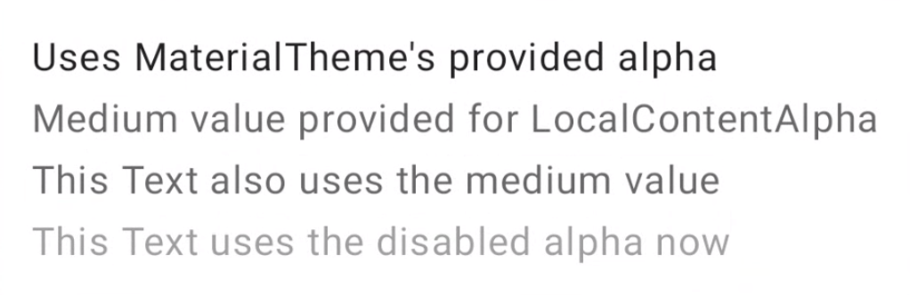

# 7주차
- CompositionLocal (https://developer.android.com/jetpack/compose/compositionlocal?hl=ko)
- [컴포즈 안티 패턴 1-5](https://velog.io/@mraz3068/Jetpack-Compose-Top-20-mistakes-1-5)
- [컴포즈 안티 패턴 6-10](https://velog.io/@mraz3068/Jetpack-Compose-Top-20-mistakes-6-10)
- [컴포즈 안티 패턴 11-15](https://velog.io/@mraz3068/Jetpack-Compose-Top-20-mistakes-11-15)
- [컴포즈 안태 패턴 16-20](https://velog.io/@mraz3068/Jetpack-Compose-Top-20-mistakes-16-20)
- [Compose Stability설명](https://medium.com/@wind.orca.pe/compose-stability%EC%84%A4%EB%AA%85-8a071b4eda83)
- [Immutable collection vs Persistent collection](https://github.com/Kotlin/kotlinx.collections.immutable)

# CompositionLocal
일반적으로 Compose에서 데이터는 UI 트리를 통해 아래로 흐른다. 색상과 같이 자주 사용되는 경우에는 매번 아래로 흐르기가 번거로울 수 있다.   

```kotlin
@Composable
fun MyApp() {
    // Theme information tends to be defined near the root of the application
    val colors = …
}

// Some composable deep in the hierarchy
@Composable
fun SomeTextLabel(labelText: String) {
    Text(
        text = labelText,
        color = // ← need to access colors here
    )
}
```   

CompositionLocal을 사용하여 UI 트리 범위의 명명된 객체를 만들 수 있다.   

CompositionLocal은 Material 테마에서 내부적으로 사용한다. MaterialTheme은 나중에 컴포지션의 하위 부분에서 가져올 수 있는 세 개의 CompositionalLocal 인스턴스(색상, 서체, 도형)을 제공하는 객체이다. 이러한 인스턴스는 구체적으로 LocalColors, LocalShapes, LocalTypography 속성으로, MaterialTheme colors, shapes, typography 속성을 통해 액세스 가능하다.   

```kotlin
@Composable
fun MyApp() {
    // Provides a Theme whose values are propagated down its `content`
    MaterialTheme {
        // New values for colors, typography, and shapes are available
        // in MaterialTheme's content lambda.

        // ... content here ...
    }
}

// Some composable deep in the hierarchy of MaterialTheme
@Composable
fun SomeTextLabel(labelText: String) {
    Text(
        text = labelText,
        // `primary` is obtained from MaterialTheme's
        // LocalColors CompositionLocal
        color = MaterialTheme.colors.primary
    )
}
```   

CompositionLocal의 current값은 컴포지션에서 범위가 지정된 부분의 상위 요소가 제공한 가장 가까운 값에 대응한다. 새 값을 CompositionaLocal에 제공하려면 CompositionLocalProvider와 CompositionLocal키를 value에 연결하는 provides 중위 함수를 사용한다.   

```kotlin
@Composable
fun CompositionLocalExample() {
    MaterialTheme { // MaterialTheme sets ContentAlpha.high as default
        Column {
            Text("Uses MaterialTheme's provided alpha")
            CompositionLocalProvider(LocalContentAlpha provides ContentAlpha.medium) {
                Text("Medium value provided for LocalContentAlpha")
                Text("This Text also uses the medium value")
                CompositionLocalProvider(LocalContentAlpha provides ContentAlpha.disabled) {
                    DescendantExample()
                }
            }
        }
    }
}

@Composable
fun DescendantExample() {
    // CompositionLocalProviders also work across composable functions
    Text("This Text uses the disabled alpha now")
}
```   

   

CompositionLocal의 현재 값에 액세스하려면 current 속성을 사용하면 된다.   
```kotlin
@Composable
fun FruitText(fruitSize: Int) {
    // Get `resources` from the current value of LocalContext
    val resources = LocalContext.current.resources
    val fruitText = remember(resources, fruitSize) {
        resources.getQuantityString(R.plurals.fruit_title, fruitSize)
    }
    Text(text = fruitText)
}
```   

## 자체 CompositionLocal 만들기
1. 중간 레이어가 인식하면 안될 때 CompositionLocal을 만든다.   
중간 레이어가 인식하도록하면 컴포저블의 유틸리티가 제한된다. 예를 들어 Android 권한 쿼리는 내부적으로 CompositionLocal에서 제공된다. 
2. 적절한 기본 값이 있어야 한다.   
기본 값이 없으면 테스트를 만들거나 CompositionLocal을 사용하는 컴포저블을 미리 볼 때 항상 명시적으로 기본값을 제공해야 한다.   
3. 트리 범위 또는 하위 계층 구조 범위로 간주되지 않는 개념에는 사용하지 않는다.   
CompositionLocal은 잠재적으로 일부 하위 요소가 아닌 모든 하위 요소에서 사용할 수 있을 때 적합하다.   

### 단점
1. 컴포저블 동작을 추론하기 어렵게 한다. 암시적 종속 항목을 만들 때 이를 사용하는 컴포저블의 호출자는 모든 CompositionLocal의 값이 충족되는지 확인해야 한다.
2. 컴포지션을 탐색하여 current 값이 제공된 위치를 확인해야 하기 때문에 앱을 디버깅하기 어려울 수 있다.   

### CompositionLocal 만들기
- compositionLocalOf : recomposition 중에 제공된 값을 변경하면 current 값을 읽는 콘텐츠만 초기화한다.
- staticCompositionLocalOf : compositionLocalOf와 달리 staticCompositionLocalOf 읽기는 Compose에서 추적하지 않는다. 값을 변경하면 CompositionLocal이 제공된 content 람다 전체가 recomposition된다.   

CompositionLocal에 제공된 값이 변경될 가능성이 거의 없거나 변경되지 않는다면 staticCompositionLocalOf를 사용하면 성능 이점을 얻을 수 있다.   

예를 들어 Elevation을 CompositionLocal을 사용할 수 있다.   
```kotlin
// LocalElevations.kt file

data class Elevations(val card: Dp = 0.dp, val default: Dp = 0.dp)

// Define a CompositionLocal global object with a default
// This instance can be accessed by all composables in the app
val LocalElevations = compositionLocalOf { Elevations() }
```   

### CompositionLocal에 값 제공
provides 함수를 사용한다.   
```kotlin
// MyActivity.kt file

class MyActivity : ComponentActivity() {
    override fun onCreate(savedInstanceState: Bundle?) {
        super.onCreate(savedInstanceState)

        setContent {
            // Calculate elevations based on the system theme
            val elevations = if (isSystemInDarkTheme()) {
                Elevations(card = 1.dp, default = 1.dp)
            } else {
                Elevations(card = 0.dp, default = 0.dp)
            }

            // Bind elevation as the value for LocalElevations
            CompositionLocalProvider(LocalElevations provides elevations) {
                // ... Content goes here ...
                // This part of Composition will see the `elevations` instance
                // when accessing LocalElevations.current
            }
        }
    }
}
```   

### CompositionLocal 사용
```kotlin
@Composable
fun SomeComposable() {
    // Access the globally defined LocalElevations variable to get the
    // current Elevations in this part of the Composition
    Card(elevation = LocalElevations.current.card) {
        // Content
    }
}
```

# Jetpack Compose에서 절대로 해서는 안되는 20가지 실수
1. Composable 함수에서 Composable이 아닌 함수를 호출하는 것    
리컴포지션이 일어날 때마다 함수가 호출된다.   
2. MutableList를 State로 사용하는 것   
Compose는 MutableList와 같은 mutable data type일 경우, 변화를 감지하지 못한다.   
3. Remember를 이용하여 State를 만드는 것   
-> 이건 실수라고 생각 안하긴해요 ...   
4. LazyColumn 내에서 Key 를 사용하지 않는 것
5. 외부 모듈로 부터 Unstable 한 class 를 사용하는 것   
[compose-stable-marker](https://github.com/skydoves/compose-stable-marker)를 사용해 해결 가능.
6. Flow를 collectAsState()를 통해서 소비하는 것   
collectAsStateLifecycle() 함수를 사용하는게 좋다.
7. GraphicsLayer 외부에서의 변환 애니메이션   
변환 애니메이션(회전, 크기 변화, 이동)은 transform modifier, graphicsLayer modifier를 사용해서 구현할 수 있다. graphicsLayer modifier를 사용할 경우 Composable의 외관이 변하지 않는다면 recomposition이 발생하지 않기 때문에 transform modifier에 비해 성능 상 유리하다.   
8. Screen 단에서 HiltViewModel을 사용하면 Preview를 사용할 수 없다.   
9. 하위 Composable에서 확장 크기를 설정하는 것   
```kotlin
// BAD
@Composable
fun MyButton(
    onClick: () -> Unit,
    modifier: Modifier = Modifier
) {
    Button(
        onClick = onClick,
        modifier = modifier 
            .clip(RoundedCornerShape(100))
            .fillMaxWidth()
    ) {
        Text(text = "Cool button")
    }
}

// GOOD
@Composable
fun MyButton(
        onClick: () -> Unit,
        modifier: Modifier = Modifier
) {
    Button(
            onClick = onClick,
            modifier = modifier
                    .clip(RoundedCornerShape(100))
    ) {
        Text(text = "Cool button")
    }
}

MyButton(
        onClick = { /*TODO*/ },
        modifier = Modifier.fillMaxWidth() // <- better 
)
```   
10. 무거운 연산 작업을 수행할 때 Remember를 사용하지 않는 것   
```kotlin
// GOOD 
@Composable
fun EncryptedImage(
    encryptedBytes: ByteArray,
    modifier: Modifier = Modifier 
) {
    val bitmap = remember(encryptedBytes) {
        val decryptedBytes = CryptoManager.decrypt(encryptedBytes)
        BitmapFactory.decodeByteArray(decryptedBytes, 0, decryptedBytes.size)
    }
    
    Image(
        bitmap = bitmap.asImageBitmap(),
        contentDescription = null,
        modifier = modifier 
    )
}
```   
11. 하드 코딩된 DP를 남발해서 사용하는 것
12. 터치 대상 크기를 잊어버리는 것
13. 프래그먼트에서 View Decomposition 전략을 확인하지 않는 것   
ComposeView를 Fragment 내부에서 사용할 때, Composition이 적절하게 파괴되기 위한 view decomposition을 적절하게 설정해야 한다.   
```kotlin
// BAD
class LoginFragment : Fragment() {
    override fun onCreateView(
        inflater: LayoutInflater,
        container: ViewGroup?,
        savedInstanceState: Bundle?
    ): View {
        return ComposeView(requireContext()).apply {
            setContent {
                // Composable screen
            }
        }
    }
}
```
위 예시 코드처럼 그냥 ComposeView를 사용하는 것은 Composition이 Fragment의 생명주기 내에 포함되는 것을 보장할 수 없다.   
```kotlin
// GOOD
class LoginFragment : Fragment() {
    override fun onCreateView(
        inflater: LayoutInflater,
        container: ViewGroup?,
        savedInstanceState: Bundle?
    ): View {
        return ComposeView(requireContext()).apply {
            setViewCompositionStrategy(
                ViewCompositionStrategy.DisposeOnViewTreeLifecycleDestroyed
            )
            setContent {
                // Composable screen
            }
        }
    }
}
```   
대신에 Fragment의 생명주기에 딱 맞도록 하는 view decomposition을 설정해라.   

14. State 명명법을 혼합하여 사용하는 것   
UI 개발에 있어서 State를 생성하고 이름을 짓는 2가지 방법이 있다.   
1.화면에 어떤 종류의 영향을 주는지를 기반으로 이름을 짓는다. (isProgressBarVisible)   
2.그 상태가 나타내는 논리적인 동작(행동)을 기반으로 이름을 짓는다. (isLoggingIn)   

가급적 일관성을 유지하는 것이 좋다.   

15. Column을 스크롤 가능하게 만드는 것을 까먹는 것
16. Composable 함수 내에서 람다의 이름을 지정하지 않는 것   
-> 의미가 명확하지 않은 경우에는 람다에 이름을 지어줘야 한다.
17. rememberCoroutineScope 를 잘못 사용하는 것   
UI와 관련되지 않은 suspend function을 Composable 내에 coroutine scope에서 사용하면 안된다. 이 coroutine scope는 화면 회전과 같은 구성 변경 이후에 취소 될 것이다.
18. 하위 Composable과 graphicsLayer의 State를 빈번하게 변경하는 것   
스크롤을 하는 경우 주의해야 한다. 또한 람다의 결과로 상태가 전달되면 Composition 단계를 스킵하고 layout 단계로 진입할 수 있다.
19. Scaffold의 content padding을 사용하지 않는 것
20. Composable 함수 내에서 return을 수행하는 것   
Composition 단계가 스킵된 경우 정의되지 않은 동작을 발생시킬 수 있다.
