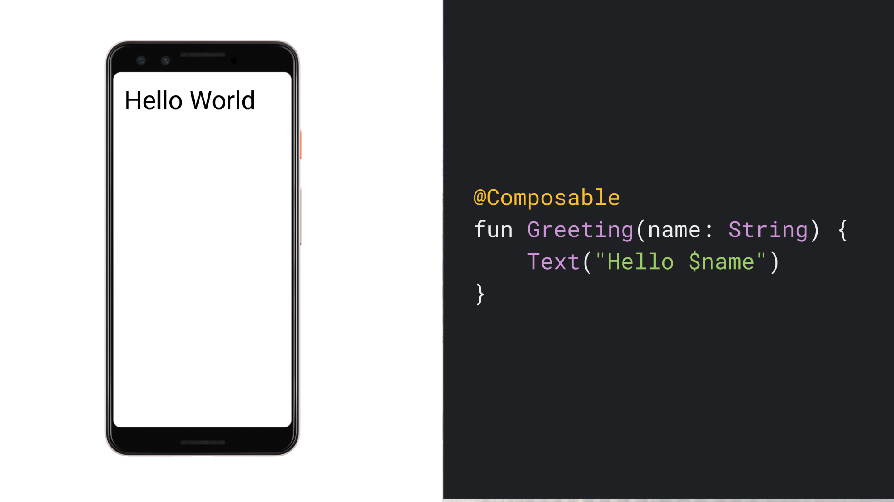
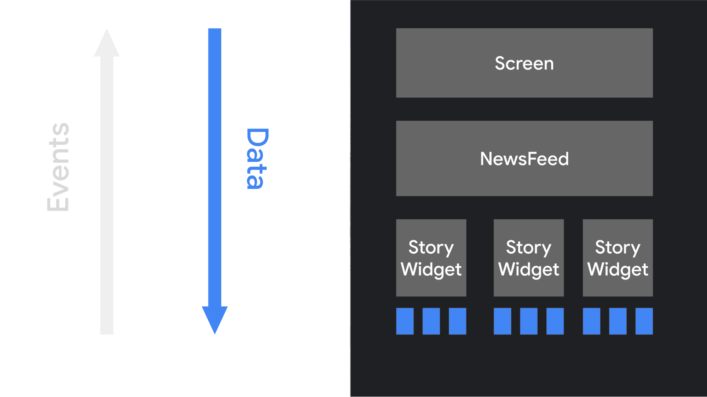
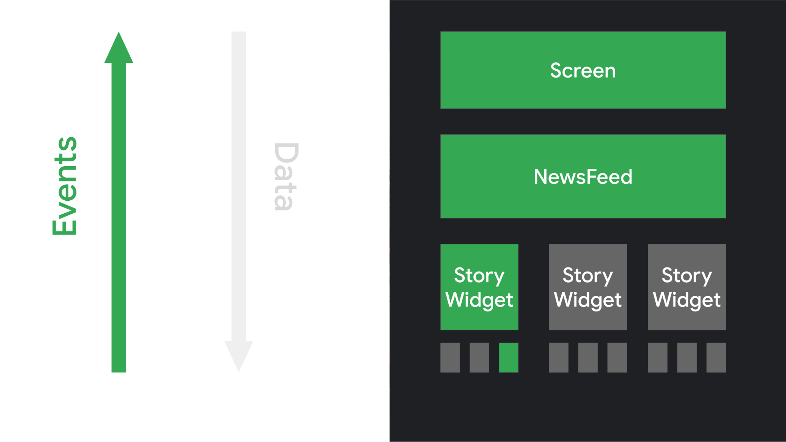
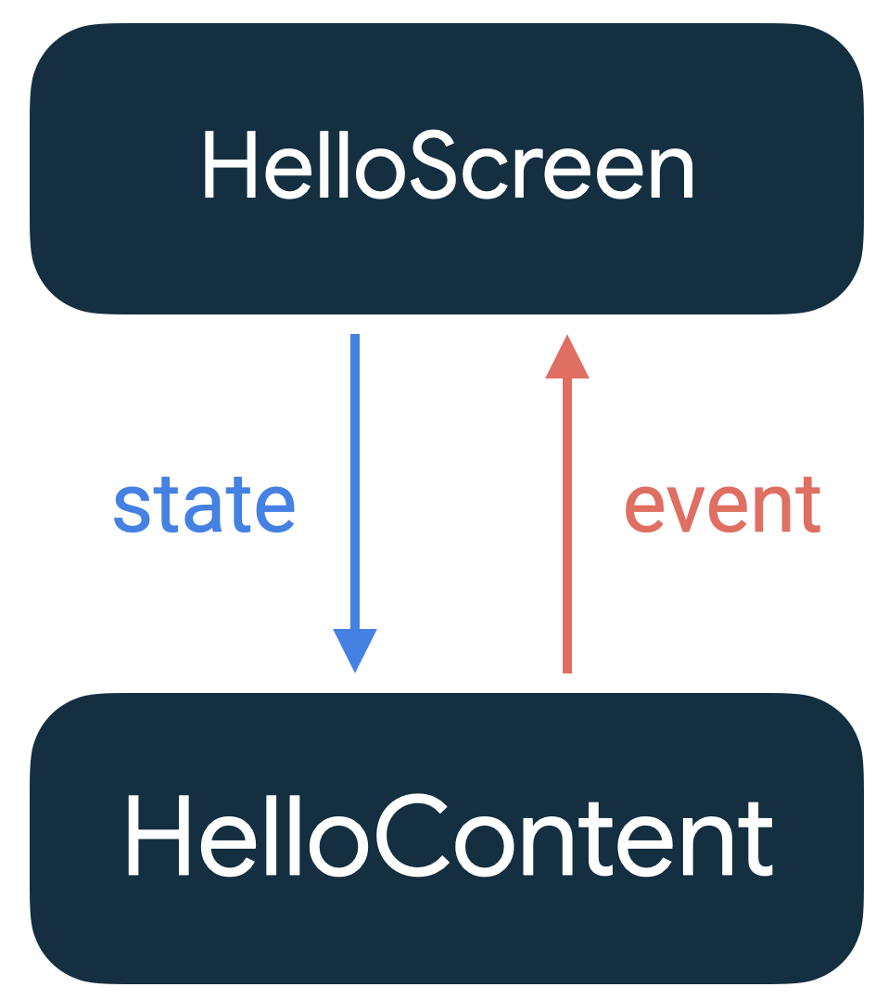

# [4주차] Compose이해, 상태관리 + 과제

# 1. Compose 이해

### Jetpack Compose

- Android를 위한 현대적인 선언형UI 도구 키트 (2021.07.28 런칭)
- Kotlin 함수로 UI 구성
- 선언형 API를 제공



cf.) API (Application Programming Interface)

→ 프로그래밍 언어나 라이브러리, 프레임워크가 제공하는 기능을 사용하기 위한 인터페이스

→ 한 소프트웨어 컴포넌트가 다른 컴포넌트와 소통하는 방법을 정의한 것

→ 함수, 메서드, 데이터 구조 등을 이용해서 정의될 수 있다.

### 선언형

- 명령형 vs 선언형

    | 명령형 프로그래밍 | 선언형 프로그래밍 |
    | --- | --- |
    | 어떻게 할지 기술하는 방법 | 무엇을 할 건지 기술하는 방법 |
    - 명령형 프로그래밍 문제점
        - View를 수동으로 조작 → 오류 발생이 쉽다.
        - View를 업데이트 하는 명령 충돌 → 예측하지 못한 View의 상태가 나타난다.
        - 업데이트 해야하는 View의 수가 많을수록 유지보수가 까다롭다.
        
        ⇒ 필요한 변경사항만 적용하는 방식으로 변경
           (시간, 컴퓨팅 성능 및 배터리 사용량의 비용이 많이 들기 때문) <br/>


- 함수에 State를 넘겨주면 → View를 생성한다. (즉, State가 바뀔 때 마다 UI가 바뀐다.)


cf.) Compose는 XML보다 여러 장점을 가지고 있다.

- 간결성
    - Compose는 Kotlin을 사용하여 UI를 선언적으로 구성한다.
    - XML보다 간결하고 읽기 쉬운 코드를 작성할 수 있다. (코드 추적 용이)
- 재사용성
    - Compose는 컴포넌트 기반의 구조를 가지고 있어, UI 요소들을 재사용하기 쉽다.
- 동적 UI
    - Compose는 상태 관리가 내장되어 있어, UI를 동적으로 쉽게 변경할 수 있다.
- 통합된 도구
    - Compose는 Kotlin을 사용하므로, UI 코드와 비즈니스 로직 코드가 같은 언어로 작성된다.
    - 때문에 동일한 도구와 기능을 사용해서 전체 애플리케이션을 개발할 수 있다.

+ 추가 Compose 장점

- 빠른 개발 과정
    - 기존의 모든 코드와 호환된다. (Compose ↔ Views 호출 가능)
    - 실시간 미리보기 기능을 지원한다.
- 강력한 성능
    - 애니메이션을 쉽고 빠르게 적용시킬 수 있다.
    - 원하는 디자인을 유연하게 구현할 수 있다.

# 2. 선언형 패러다임 전환

- Compose의 선언형 접근 방식에서 위젯은 Stateless 상태이며, 객체로 노출되지 않는다.
    - 자체 상태를 내부적으로 관리하지 않는다.
    - 매개변수를 통해 상태를 수신하고, 이벤트를 내보내 컴포저블에 변경사항을 알린다.





ex)

```kotlin
@Composable 
fun  SimpleButton (text: String , onClick: () -> Unit ) { 
    Button(onClick = onClick) { 
        Text(text) 
    } 
} 

@Composable 
fun  StatelessScreen () { 
    val text = "클릭하세요!"
    SimpleButton(text = text) { /* 클릭 이벤트 처리 */ } 
}
```

- 앱 로직과 데이터 전달
    - StatelessScreen이 최상위 Composable 함수로 앱 로직을 담당한다.
    - “클릭하세요!” 문자열 데이터를 SimpleButton에 제공하며, 이에 따라 버튼이 생성된다.
- 사용자 상호작용과 이벤트 처리
    - 사용자가 버튼을 클릭하면 onClick 이벤트가 발생한다.
    - 해당 이벤트는 SimpleButton에 정의된대로 처리되어, 상태를 변경할 수 있다.
- 재구성
    - 상태가 변경되면, StatelessScreen은 새로운 상태와 함께 다시 호출된다.
    - 이 때, UI가 자동으로 업데이트 된다. → 이 과정을 ‘재구성(recomposition)’이라고 한다.
- 이벤트 트리거와 응답
    - 사용자의 상호작용은 UI요소에 이벤트를 트리거한다.
    - 버튼 클릭은 onClick 이벤트를 트리거 한다.
    - 앱 로직은 이 이벤트에 응답해서 상태를 변경시키고, 변경된 상태는 컴포저블 함수에 의해 화면에 반영된다.

# 3. 재구성 (Recompostion)

### 재구성 (Recomposition)

- Compose에서는 위젯의 상태를 변경하기 위해, 새로운 데이터를 가진 컴포저블 함수를 다시 호출한다.
- 이 때 함수에 의해 생성된 위젯이 필요한 경우 새로운 데이터로 다시 그려진다.

⇒ 이 과정을 recomposition이라고 하며, 필요한 컴포넌트만을 효율적으로 다시 그릴 수 있다.

### Compose에서 프로그래밍할 때 알아야할 여러가지 사항

- 컴포저블 함수는 순서와 관계없이 실행할 수 있다.

    ```kotlin
    @Composable
    fun ButtonRow() {
        MyFancyNavigation {
            StartScreen()
            MiddleScreen()
            EndScreen()
        }
    }
    ```
    
  : StartScreen, MiddleScreen, EndScreen 호출은 순서와 관계없이 발생할 수 있다.

- 컴포저블 함수는 동시에 실행할 수 있다.
    - Compose는 컴포저블 함수를 동시에 실행해서 Recomposition을 최적화할 수 있다.
        - 현재 화면에 표시되지 않는 UI 요소(예를 들어, 스크롤로 인해 화면 밖에 있는 요소)의 처리를 뒤로 미룰 수 있다. → 사용자에게는 앱이 더 빨리 반응하는 것처럼 느껴질 수 있다.
    - 모든 컴포저블 함수에 Side-Effect가 없어야 한다.
        - Side-effect : 함수가 실행되면서 외부에 있는 것들에 영향을 주는 것

          ex) 함수가 실행되면서 전역변수를 변경하거나, 데이터베이스에 쓰기를 수행하는 경우, …

        - 만약 함수가 Side-Effect를 갖고 있다면, 함수가 실행될 때마다 앱의 다른 부분에 영향을 줄 수 있고, 예측하지 못한 문제를 일으킬 수 있다.
    - 컴포저블 함수(람다)가 실행되는 동안, 그 함수 내에서 변수를 변경하는 것은 좋지 않다.
        - Compose는 여러 스레드에서 동시에 컴포저블 함수를 실행할 수 있는데, 만약 한 스레드에서 실행중인 함수가 변수를 변경하면 → 그 변경사항이 다른 스레드에 영향을 줄 수 있다.

- Recomposition은 최대한 많은 수의 컴포저블 함수 및 람다를 건너뛴다.
    - Compose는 업데이트해야 하는 부분만 재구성하기 위해 최선을 다한다.
    - 모든 컴포저블 함수 및 람다는 자체적으로 Recomposition을 할 수 있다.
        - Recomposition이 일부 요소를 건너뛸 수 있음을 보여주는 예시

            ```kotlin
            /**
             * 헤더와 함께 사용자가 클릭할 수 있는 이름 목록 표시
             */
            @Composable
            fun NamePicker(
                header: String,
                names: List<String>,
                onNameClicked: (String) -> Unit
            ) {
                Column {
             // [header]가 변경될 때 재구성되지만 [names]이 변경될 때는 재구성되지 않습니다.
                    Text(header, style = MaterialTheme.typography.h5)
                    Divider()
            // LazyColumn은 RecyclerView의 Compose 버전입니다.
            // items()에 전달된 람다는 RecyclerView.ViewHolder와 유사합니다.
                    LazyColumn {
                        items(names) { name ->
            // 항목의 [names]이 업데이트되면 해당 항목의 어댑터가 재구성됩니다.
            // [header]가 변경되면 재구성되지 않습니다.
                            NamePickerItem(name, onNameClicked)
                        }
                    }
                }
            }
            /**
             * 사용자가 클릭할 수 있는 Text를 표시합니다.
             */
            @Composable
            private fun NamePickerItem(name: String, onClicked: (String) -> Unit) {
                Text(name, Modifier.clickable(onClick = { onClicked(name) }))
            }
            ```


- Recomposition은 낙관적이며 취소될 수 있다.
    - 낙관적 : 앞으로의 일 따위가 잘되어 갈 것으로 여김
    - Compose는 매개변수가 다시 변경되기 전에 Recomposition을 완료할 것으로 예상한다.
    - Recomposition이 완료되기 전에 매개변수가 변경되면, Recomposition을 취소하고 새 매개변수를 사용해서 Recomposition을 다시 시작할 수 있다.

- 컴포저블 함수는 애니메이션의 모든 프레임에서와 같은 빈도로 매우 자주 실행될 수 있다.
    - 데이터가 필요한 컴포저블 함수는 데이터에 대한 매개변수를 정의해야 한다.
    - 비용이 많이 드는 작업을 외부의 다른 스레드로 이동하고, mutableStateOf나 LiveData를 사용하여 데이터를 Compose에 전달해야 한다.

# 4. 상태 관리

### State란?

- 시간이 지남에 따라 변할 수 있는 값

### State와 Composition

```kotlin
@Composable
fun HelloContent() {
   Column(modifier = Modifier.padding(16.dp)) {
       Text(
           text = "Hello!",
           modifier = Modifier.padding(bottom = 8.dp),
           style = MaterialTheme.typography.h5
       )
       OutlinedTextField(
           value = "",
           onValueChange = { },
           label = { Text("Name") }
       )
   }
}
```

- 이 코드를 실행하면 아무 일도 일어나지 않는다.
- OutlinedTextField의 value 값이 변경될 때 업데이트가 실행될 것이다.
- 이유는 Composition과 Recomposition 작동방식 때문이다.

cf.) 용어 정리 (5주차)

- `Composition`
    - 앱의 UI를 설명 (UI == 컴포저블)
    - Jetpack Compose가 컴포저블을 실행할 때 빌드한 UI에 관한 설명
- `Init Composition`
    - 처음 컴포저블을 실행하여 Composition을 생성
    - Composition에서 UI를 그리기 위해 호출한 컴포저블 추적
- `Recomposition`
    - 데이터가 변경될 때 Composition을 업데이트 하기 위해 컵포저블을 다시 실행하는 것
    - 상태가 바꼈을 때 예약되며, 변경 사항을 반영하려 Composition을 업데이트 함 (수정하는 유일한 방법)

### Composable의 State

- remember
    - 단일 객체를 메모리에 저장할 수 있다.
    - remember에 의해 계산된 값은 initial composition 중에 composition에 저장되고, 저장된 값은 recomposition 중에 반환된다.
    - remember를 호출한 컴포저블이 지워지면, 같이 사라진다.

  ⇒ State를 기억해야 하는 경우, remember를 이용해 값을 저장할 수 있다.


- mutableStateOf()
    - 관찰될 수 있는 MutableState<T> 생성한다.
    - 변경될 때마다, 컴포저블이 다시 recomposition이 발생한다.

- MutableState 객체 선언하기 (3가지)
    - 단순 remember 사용

        ```kotlin
        val mutableState = remember { mutableStateOf(default) }
        ```

    - by 사용 (Delegation)

        ```kotlin
        var value by remember { mutableStateOf(default) }
        ```

      → 주의) 하나의 값에서 setValue도 일어나야 하기 때문에 var를 사용해야 한다!

    - 구조 분해 사용

        ```kotlin
        val (value, setValue) = remember { mutableStateOf(default) }
        ```

      [https://github.com/YAPP-Github/23rd-Study-jetpack-compose/tree/main/syb8200/2주차](https://github.com/YAPP-Github/23rd-Study-jetpack-compose/tree/main/syb8200/2%EC%A3%BC%EC%B0%A8)


### rememberSavable

⚠️ BUT!! <br/>
`remember`에 의해 계산된 값은 configuration이 발생하면 값이 유지되지 않는다!

⇒ configuration이 발생하는 경우 : rotation (Activity가 재생성 된다 → 모든 상태를 잃게 된다)

⇒ remember의 한계 : 생명주기에 따라 파괴될 수 있다!

- **rememberSavable**
    - remember의 한계를 극복하기 위해 사용된다.
    - remember와 같은 역할을 하지만, 프로세스 종료 or Activity 재생성과 같은 상황에서도 유지된다.
    - `Bundle`에 저장할 수 있는 모든 값을 자동으로 저장한다.
        - primitive type, string, array, 등 …


⚠️ BUT!! <br/>
메모리의 한계가 있기 때문에, 모든 값을 `rememberSavable`로 하는 것은 좋지 않다!


### 기타 지원되는 State 타입

- 컴포저블이 MutableState만을 observing하지 않는다.
- State<T>를 구현하는 경우 이를 observing 할 수 있는데. State로 변경하는 extension function을 제공한다.
    - LiveData

        ```kotlin
        val liveData: LiveData<String> = //...
        val state: State<String?> = liveData.observeAsState()
        
        Text(text = state.value ?: "Loading...")
        ```
        
      : `observeAsState()` 확장함수를 사용하여 LiveData를 State객체로 변환할 수 있다.

    - Flow
        - collectAsStateWithLifecycle()

            ```kotlin
            @Composable
            fun MyComposable(lifecycleOwner: LifecycleOwner) {
                val flow: Flow<String> = //...
                val state: State<String?> = flow.collectAsStateWithLifecycle(lifecycleOwner)
            
                Text(text = state.value ?: "Loading...")
            }
            ```
            
          : `collectStateWithLifecycle()`을 사용하려면, Composable이 속한 LifecycleOwner를 인자로 전달해야 한다.

          : LifecycleOwner의 생명주기에 따라 Flow 수집을 자동으로 시작하거나 중지한다.

          : Composable이 화면에서 사라질 때 불필요한 작업을 중지하여 리소스를 절약할 수 있다.

        - collectAsState()

            ```kotlin
            val flow: Flow<String> = //...
            val state: State<String?> = flow.collectAsState()
            
            Text(text = state.value ?: "Loading...")
            ```
            
          : `collectAsState()` 확장함수를 사용하여 Flow를 State 객체로 변환할 수 있다.

    - RxJava2 / Rxjava3

        ```kotlin
        val observable: Observable<String> = //...
        val state: State<String?> = observable.subscribeAsState()
        
        Text(text = state.value ?: "Loading...")
        ```
        
      : `subscribeAsState()` 함수는 RxJava의 Observable 스트림을 Compose의 State로 변환해주는 역할을 한다.


### Stateful vs Stateless

- Stateless
    - 자체 상태를 내부적으로 관리하지 않는 컴포저블
    - 상태가 없어서 스스로 recomposition 할 수 없다.
    - 매개변수를 통해 상태를 수신하고 이벤트를 내보내 상위 컴포저블에 변경사항을 알린다.

    ```kotlin
    @Composable
    fun SimpleButton(text: String, onClick: () -> Unit) {
        Button(onClick = onClick) {
            Text(text)
        }
    }
    
    @Composable
    fun StatelessScreen() {
        val text = "Click me!"
        SimpleButton(text = text) { /* Handle click event */ }
    }
    ```

- Stateful
    - 자체 내부 상태를 관리한다.
    - 상태가 변하면 자신과 자식 컴포저블이 recomposition 된다.
    - 내부적으로 상태를 관리하면 컴포저블의 재사용성이 떨어지고, 테스트하기가 어려워질 수 있다.

    ```kotlin
    @Composable 
    fun  CounterButton () { 
        var count by remember { mutableStateOf( 0 ) } // 내부 상태 생성
    
        Button(onClick = { count++ }) { 
          Text( "Count: $count " ) 
        } 
    } 
    
    @Composable 
    fun  StatefulScreen () { 
      CounterButton() 
    }
    ```


### State Hoisting (상태 호이스팅)

- **StateHoisting**

  : 컴포저블을 Stateless 하게 만들기 위해 컴포저블의 호출자로 옮기는 패턴

  : 일반적인 패턴) 상태 변수를 두 개의 매개변수로 바꾸는 것

    - `value: T` : 표시할 현재 값
    - `onValueChange: (T) → Unit` : T가 제안된 새 값인 경우 값을 변경하도록 요청하는 이벤트

    ```kotlin
    // 상태값 변경에 관한 것은 여기서 처리.
    @Composable
    fun HelloScreen() {
        var name by rememberSaveable { mutableStateOf("") }
    
        HelloContent(name = name, onNameChange = { name = it })
    }
    
    // 어떤 상태가 있는지 모르고, 상태에 대해서 전혀 개입하지 않음.
    // UI만 처리 (상태가 없음 -> Stateless)
    // 재사용하며 테스트 하기 좋음
    @Composable
    fun HelloContent(name: String, onNameChange: (String) -> Unit) {
        Column(modifier = Modifier.padding(16.dp)) {
            Text(
                text = "Hello, $name",
                modifier = Modifier.padding(bottom = 8.dp),
                style = MaterialTheme.typography.h5
            )
            OutlinedTextField(
                value = name,
                onValueChange = onNameChange,
                label = { Text("Name") }
            )
        }
    }
    ```

    
  (단방향 데이터 흐름)