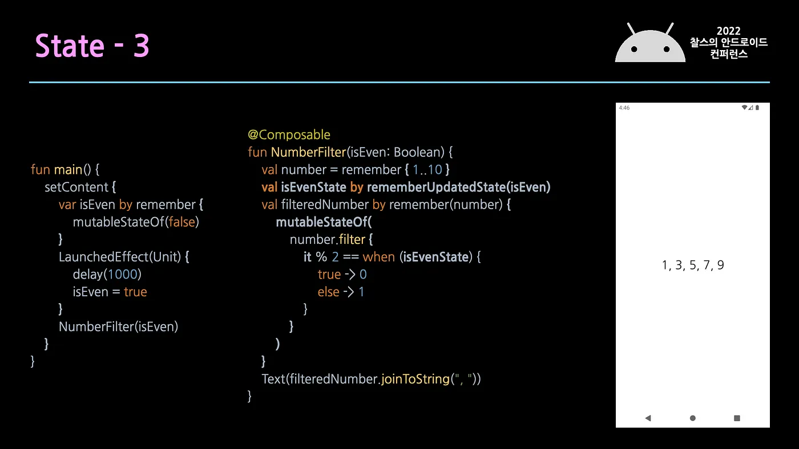

# 1. 수명주기

### 1) Compose의 수명주기

- Composition(컴포지션)

  : 컴포저블 함수를 실행할 때 빌드한 UI를 설명하는 것


- 수명주기 [3단계]

    

    - **Initial Composition** : 처음으로 컴포저블을 실행해서 Composition을 생성
    - **ReComposition** : 상태가 변경되었을 때, Composition을 업데이트 하기 위해 컴포저블을 다시 실행
        - 0회 이상 ReComposition 된다.
        - ReComposition을 통해서만 Composition을 업데이트 할 수 있다.
        - `State<T>` 객체가 변경될 때마다 ReComposition이 시작된다.
          Composition 내에서 특정 `State<T>`를 읽고 Skip될 수 없는 모든 컴포저블을 호출한다.
    - **Leave the Composition** : Composition 종료

### 2) Composition 내 컴포저블의 분석

- 호출 사이트(call site)

  : 컴포저블이 <u>호출되는 소스 코드 위치</u>

  → 컴포저블은 호출 사이트 기준으로 식별된다!

  → 여러 호출 사이트에서 컴포저블을 호출하면, Composition에 여러 인스턴스가 생성된다.

    ```kotlin
    @Composable
    fun LoginScreen(showError: Boolean) {
        if (showError) {
            LoginError()
        }
        LoginInput() // This call site affects where LoginInput is placed in Composition
    }
    
    @Composable
    fun LoginInput() { /* ... */ }
    ```

    - LoginInput은 두 번 호출되었지만, 변경된 사항이 없으므로 두 번째 호출은 건너뛰게 된다. <br/>
  
      (= 입력이 바뀌지 않은 컴포저블은 재구성하지 않는다.)

        


- 호출 사이트 + <u>실행 순서</u> 사용하여 식별

  : 컴포저블을 여러번 호출하면 → Composition에도 여러 번 추가된다.
  : 동일한 호출 사이트에서 컴포저블을 여러 번 호출하면, 해당 컴포저블에 대한 각 호출을 식별하는 정보가 없기 때문에, 실행 순서도 같이 사용한다.

    ```kotlin
    @Composable
    fun MoviesScreen(movies: List<Movie>) {
        Column {
            for (movie in movies) {
                // MovieOverview composables are placed in Composition given its
                // index position in the for loop
                MovieOverview(movie)
            }
        }
    }
    ```

    - MovieOverview 두 번째꺼까지 재사용을 하고, 마지막 것만 추가되어 ReComposition이 발생한 경우

        

    ```kotlin
    @Composable
    fun MovieOverview(movie: Movie) {
        Column {
            // Side effect explained later in the docs. If MovieOverview
            // recomposes, while fetching the image is in progress,
            // it is cancelled and restarted.
            val image = loadNetworkImage(movie.url)
            MovieHeader(image)
    
            /* ... */
        }
    }
    ```
    
    - 첫 번째 MovieOverview 항목이 추가되었을 때, 기존의 첫 번째, 두 번째 항목이 추적되지 않기 때문에 → 3개의 MovieOverview가 전부 ReComposition이 일어나게 된다. <br/>
    ⇒ 이걸 해결하기 위해서는 <u>**Smart ReComposition**</u>이 필요함
    
       
        
    
- 런타임에 트리의 특정 부분(key 컴포저블)을 식별하는 데 사용할 값을 지정할 수 있다.
    - key는 고유하지 않아도 되고, 컴포저블 호출 간에만 고유하면 된다.

    ```kotlin
    @Composable
    fun MoviesScreen(movies: List<Movie>) {
        Column {
            for (movie in movies) {
                key(movie.id) { // Unique ID for this movie
                    MovieOverview(movie)
                }
            }
        }
    }
    ```

    - 첫 번째 항목이 추가되더라도, 개별 MovieOverview 호출을 인식하고 재사용할 수 있다.

        


### 3) 입력이 변경되지 않은 경우 건너뛰기 (Skipping)
> 컴포저블이 이미 Composition에 있는 경우, <u>입력이 stable(안정적)하고 + 변경되지 않았다면</u> →  **ReComposition을 skip 할 수 있다.**

- ReComposition을 건너뛰는 케이스 (안정적)
    - 두 인스턴스에 대한 `equals`의 결과가 항상 동일해야 한다.
    - public property가 변경되면 Composition에 알려야 한다.
    - 모든 public property 타입은 <u>stable</u> 해야 한다.

- Compose는 <u>증명할 수 있는 경우에만</u> 안정적인 것으로 간주한다. <br/>
  (= 어떤 유형이 어떻게 동작하는지 확실하게 알 수 있는 경우)
    - interface
      : 구현을 변경할 수 없기 때문에, 어떤 동작을 할지 확실히 알 수 없으므로 → 안정적X

- 안정적이라고 추론할 수 없는데, 안정적인 것으로 간주하게 하고 싶다? <br/>

  → `@Stable` 주석을 사용해서 <u>명시적으로 stable 하다고 표시!</u>

    ```kotlin
    // Marking the type as stable to favor skipping and smart recompositions.
    @Stable
    interface UiState<T : Result<T>> {
        val value: T?
        val exception: Throwable?
    
        val hasError: Boolean
            get() = exception != null
    }
    ```
    
  : UiState가 Interface이기 때문에 → stable 하지 않다고 간주할 수 있다.

  : 하지만 `@Stable` 주석을 추가해주면, 모든 Composition을 안정적인 것으로 간주한다.


- `@Stable`이 표기되지 않아도 Compose 컴파일러가 stable 하다고 간주하는 <u>공통 타입들</u>이 있다.
    - Primitive 타입 (Boolean, Int, Long, Float 등…)
    - 문자열 (String)
    - 모든 함수 타입 (람다)

<br/>

# 2. 부수효과 (Side Effect)

- 컴포저블 함수의 범위 밖에서 발생하는 앱 상태에 관한 변경사항
- 컴포저블에는 부수효과가 없는 것이 좋다.
    - 하지만, <u>부수효과가 필요한 경우</u>도 있다.
        - Snackbar 표시
        - 특정 상태 조건에 따라 다른 화면으로 이동 (일회성 이벤트)

### 1) 상태 및 효과 사용 사례

- <u>Effect</u> API
    - UI를 내보내지 않으며 Composition이 완료될 때 부수효과를 실행하는 컴포저블 함수
    - 컴포저블 밖에서 발생하는 상태에 대해 변경이 필요할 때 Effect API를 사용해야 한다.
    - Effect API에서의 작업은 <u>UI와 관련</u>되어 있어야 하고, <u>단방향 데이터 흐름</u>을 해치면 안된다.

cf.) 기본적으로 반응형 UI는 비동기로 진행되며, Compose에서는 <u>코루틴</u>을 이용한다.

### 2) LaunchedEffect : 컴포저블 범위에서 <u>suspend 함수</u> 실행

```kotlin
/**
 * When [LaunchedEffect] enters the composition it will launch [block] into the composition's
 * [CoroutineContext]. The coroutine will be [cancelled][Job.cancel] and **re-launched** when
 * [LaunchedEffect] is recomposed with a different [key1]. The coroutine will be
 * [cancelled][Job.cancel] when the [LaunchedEffect] leaves the composition.
 *
 * This function should **not** be used to (re-)launch ongoing tasks in response to callback
 * events by way of storing callback data in [MutableState] passed to [key1]. Instead, see
 * [rememberCoroutineScope] to obtain a [CoroutineScope] that may be used to launch ongoing jobs
 * scoped to the composition in response to event callbacks.
 */
@Composable
@NonRestartableComposable
@OptIn(InternalComposeApi::class)
fun LaunchedEffect(
    key1: Any?,
    block: suspend CoroutineScope.() -> Unit
) {
    val applyContext = currentComposer.applyCoroutineContext
    remember(key1) { LaunchedEffectImpl(applyContext, block) }
}
```

- LaunchedEffect
    - 컴포저블 내에서 안전하게 suspend 함수를 호출할 때 사용한다. <br/>
      (= 컴포저블에서 Composition이 일어날 때, suspend 함수를 실행해주는 컴포저블이다.)
    - LaunchedEffect가 Composition을 시작하면 매개변수로 전달된 코드 block으로 코루틴이 실행된다.
    - LaunchedEffect가 Composition을 종료하면 코루틴이 취소된다.
    - ReComposition이 일어날 때마다 매번 이전 LaunchedEffect가 취소되고 다시 수행된다면 매우 비효율적일 것이다.

      → 때문에 기준값인 key가 바뀔 때만 suspend 함수를 취소하고 재실행한다.

  <br/>

    ```kotlin
    @Composable
    fun MyScreen(
        state: UiState<List<Movie>>,
        scaffoldState: ScaffoldState = rememberScaffoldState()
    ) {
    
        // If the UI state contains an error, show snackbar
        if (state.hasError) {
    
            // `LaunchedEffect` will cancel and re-launch if
            // `scaffoldState.snackbarHostState` changes
            LaunchedEffect(scaffoldState.snackbarHostState) {
                // Show snackbar using a coroutine, when the coroutine is cancelled the
                // snackbar will automatically dismiss. This coroutine will cancel whenever
                // `state.hasError` is false, and only start when `state.hasError` is true
                // (due to the above if-check), or if `scaffoldState.snackbarHostState` changes.
                scaffoldState.snackbarHostState.showSnackbar(
                    message = "Error message",
                    actionLabel = "Retry message"
                )
            }
        }
    
        Scaffold(scaffoldState = scaffoldState) {
            /* ... */
        }
    }
    ```
    
    : UiState에 오류가 포함되어 있으면 → 코루틴이 트리거 되고 → 스낵바를 표시한다.
    
    : UiState에 오류가 포함되어 있지 않으면 → 코루틴이 취소되고 → 스낵바는 사라진다.


### 3) rememberCoroutineScope : 컴포저블 <u>외부에서</u> 코루틴 실행

- rememberCoroutineScope
    - LaunchedEffect는 컴포저블 함수로, 컴포저블 함수 내에서만 사용할 수 있다.
    - 때문에 컴포저블 외부에서 코루틴 스코프를 얻으려면 → rememberCoroutineScope를 사용해야 한다.

    ```kotlin
    @Composable
    fun MoviesScreen(scaffoldState: ScaffoldState = rememberScaffoldState()) {
    
        // Creates a CoroutineScope bound to the MoviesScreen's lifecycle
        val scope = rememberCoroutineScope()
    
        Scaffold(scaffoldState = scaffoldState) {
            Column {
                /* ... */
                Button(
                    onClick = {
                        // Create a new coroutine in the event handler to show a snackbar
                        scope.launch {
                            scaffoldState.snackbarHostState.showSnackbar("Something happened!")
                        }
                    }
                ) {
                    Text("Press me")
                }
            }
        }
    }
    ```


> **Q. 그냥 컴포저블 함수 내부에서 LaunchedEffect를 사용하면 되는 것 아닌가?
왜 rememberCoroutineScope를 사용하는거지?**

- rememberCoroutineScope를 사용하는 주요 이유는 코루틴을 보다 세밀하게 제어할 때 유용하다.
    - LaunchedEffect : 컴포저블이 구성될 때(생명주기에 따라) 자동으로 코루틴을 시작하지만,
    - rememberCoroutineScope : <u>코루틴을 직접 시작하고 중단</u>하는 방법을 제공한다. <br/>
      ex) 버튼 클릭에 응답(특정 이벤트에 응답)하는 코루틴을 시작하고 싶을 때
- rememberCoroutineScope는 코루틴의 결과를 컴포저블 외부에 전달할 때도 유용하다.

### 4) rememberUpdatedState : 값이 변경되는 경우 다시 시작되지 않아야 하는 효과에서 값 참조

- LaunchedEffect는 내부 블록의 값이 변경되면 → 기존 코루틴을 취소하고, 새로운 코루틴을 실행한다.
- LaunchedEffect 내부 값을 변경해야 하지만 + 새로운 코루틴을 실행하면 안되거나 / Effect가 오래 걸려서 작업을 유지해야 하는 경우 → rememberUpdatedState를 사용한다. <br/>
  (= Effect가 오래 기다려야 하는 작업을 유지해야 하거나, 무거운 연산이나, ReComposition에 의해서 재시작되지 않도록 할 때 유용하다.)


```kotlin
@Composable
fun <T> rememberUpdatedState(newValue: T): State<T> = remember {
    mutableStateOf(newValue)
}.apply { value = newValue }
```

: 일반적인 remember{ mutableStateOf(value) } 패턴에 apply가 붙어있다.

: ReComposition이 발생하면 이전에 remember로 저장한 상태가 불러진다.

: 상태가 만들어졌을 때의 값을 가지고 있기 때문에 오래된 값을 가지고 있다.

: apply를 통해 이전 상태의 값을 새 값으로 업데이트 한다.

```kotlin
@Composable
fun ShowSnackBar(scaffoldState: ScaffoldState = rememberScaffoldState(), timeoutText: String) {
    val currentTimeoutText by rememberUpdatedState(timeoutText)

    LaunchedEffect(true) {
        try {
            delay(3000L)
            scaffoldState.snackbarHostState.showSnackbar(currentTimeoutText)
        } catch (ce: CancellationException) {

        }
    }

}
```

: timeoutText가 변하더라도 LaunchedEffect는 재시작하지 않고(true로 고정되어 stable한 상태), 3초 후에 snackbar를 띄운다.

: 만약 rememberUpdateState를 사용하지 않는다면, timeoutText가 변해도 똑같은 snackbar가 표시될 것이다.

### 5) DisposableEffect : 정리가 필요한 효과

- DisposableEffect
    - 컴포저블이 <u>Composition을 종료한 이후 정리해야하는 부수 효과가 있을 때</u> 사용한다.
    - 컴포저블의 <u>수명주기에 맞게 정리되어야할 리스너가 있거나, 처리해야 할 이벤트가 있는 경우</u> 사용한다.
    - LaunchedEffect와 동작 방식은 동일하나, Side Effects 처리 도중 재시작되거나 / Composition이 leave 상태가 되는 경우 → `onDispose {…}` 구문이 항상 호출된다.
    - DisposableEffect는 onDispose을 코드 블록의 최종 문장으로 적어야 한다. 그렇지 않으면 IDE 오류가 표시된다.

    ```kotlin
    @Composable
    fun HomeScreen(
        lifecycleOwner: LifecycleOwner = LocalLifecycleOwner.current,
        onStart: () -> Unit,
        onStop: () -> Unit
    ) {
        // 새로운 람다식이 들어왔을 때 안전하게 실행할 수 있도록 rememberUpdatedState를 사용합니다.
        val currentOnStart by rememberUpdatedState(onStart)
        val currentOnStop by rememberUpdatedState(onStop)
    
        // lifecycleOwner가 변경되면 DisposableEffect내에 있는 코루틴이 다시 시작됩니다.
        DisposableEffect(lifecycleOwner) {
            val observer = LifecycleEventObserver { _, event ->
                if (event == Lifecycle.Event.ON_START) {
                    currentOnStart()
                } else if (event == Lifecycle.Event.ON_STOP) {
                    currentOnStop()
                }
            }
    
            lifecycleOwner.lifecycle.addObserver(observer)
    
            // Effect가 Composition을 떠날 때 observer를 삭제합니다.
            onDispose {
                lifecycleOwner.lifecycle.removeObserver(observer)
            }
        }
    
        /* Home screen content */
    }
    ```


### 6) SideEffect : Compose 상태를 비 Compose 코드에 게시

- SideEffect
    - Compose의 상태를 ↔ <u>Compose에서 관리하지 않는 객체와 공유할 때</u> 사용한다.
        - Compose의 수명주기나 상태 관리 시스템에 의해 직접적으로 관리되지 않는 객체 <br/>
          (Compose의 수명주기나 상태 변경에 따라 자동으로 업데이트 되지 않는다.) <br/>
          ⇒ SideEffect를 사용해서 값을 업데이트 한다.
        - Compose 외부에서 생성되고 관리되는 객체 <br/>
          (네트워크 라이브러리, 데이터베이스, 애널리틱스 라이브러리 등…)
    - ReComposition이 성공할 때마다 호출된다.

    ```kotlin
    @Composable
    fun rememberAnalytics(user: User): FirebaseAnalytics {
        val analytics: FirebaseAnalytics = remember {
            /* ... */
        }
    
        // On every successful composition, update FirebaseAnalytics with
        // the userType from the current User, ensuring that future analytics
        // events have this metadata attached
        SideEffect {
            analytics.setUserProperty("userType", user.userType)
        }
        return analytics
    }
    ```


### 7) produceState : 비 Compose 상태를 Compose 상태로 변환

- Compose에서는 State<T>를 통해 상태를 관찰하고 컴포저블을 업데이트 한다.
- Flow, LiveData, RxJava 등 <u>observable한 타입들</u>을 Compose에서 사용하려면 <u>State</u>로 변환하는 과정이 필요한데 → 그 역할을 **produceState**가 한다.

- produceState
    - 관찰하고 있는 값이 변경되면 State<T>로 반환한다.
    - Flow, LiveData를 위해 State로 변환하는 함수를 지원한다.
        - LiveData<T> : `observeAsState()`
        - Flow<T> : `collectAsState()`

    ```kotlin
    @Composable
    fun MovieOverview(movie: Movie) {
        Column {     
            val image = loadNetworkImage(movie.url)
            MovieHeader(image)
        }
    }
    ```
    
    ```kotlin
    @Composable
    fun loadNetworkImage(
        url: String,
        imageRepository: ImageRepository
    ): State<Result<Image>> {
    
        // 초기값으로 Result.Loading을 세팅하고, url, imageRepository가 변경되면
        // 실행중인 producer(coroutine)이 취소되고 재시작됨
        return produceState(initialValue = Result.Loading, url, imageRepository) {
    
            // coroutine scope 내부이므로 suspend function을 호출할 수 있습니다.
            val image = imageRepository.load(url)
    
            // 진행 결과에 따라 value에 값을 세팅하여 emit 합니다.
            value = if (image == null) {
                Result.Error
            } else {
                Result.Success(image)
            }
        }
    }
    ```


### 8) derivedStateOf : 하나 이상의 상태 객체를 다른 상태로 변환

- derivedStateOf
    - 다른 State에서 파생된 State를 원할 때 사용된다.

    ```kotlin
    @Composable
    fun TodoList(highPriorityKeywords: List<String> = listOf("Review", "Unblock", "Compose")) {
    
        val todoTasks = remember { mutableStateListOf<String>() }
    
        val highPriorityTasks by remember(highPriorityKeywords) {
            derivedStateOf { todoTasks.filter { it.containsWord(highPriorityKeywords) } }
        }
    
        Box(Modifier.fillMaxSize()) {
            LazyColumn {
                items(highPriorityTasks) { /* ... */ }
                items(todoTasks) { /* ... */ }
            }
        }
    }
    ```
    
  : todoTasks가 변경될 때마다 highPriorityTask의 계산이 실행되고, UI가 업데이트됨을 보장한다.

  : highPriorityKeywords가 변경되면 remember 블록이 실행되고, 이전 파생 상태 객체 대신 새로운 파생 상태 객체가 생성되고 기억된다.


### 9) 효과 다시 시작

> LaunchedEffect, produceState, DisposableEffect와 같은 Compose의 일부 효과는
실행중인 Effect를 취소하고 → 새로운 Effect를 실행하기 위해 여러 매개변수를 받는다.<br/>
매개변수가 변경되면 새로운 Effect가 실행된다.

- 효과를 다시 실행할 때는 두 가지를 고려해야 한다.
    - 필요한 것보다 적은 Effect를 다시 시작하면 앱의 버그가 발생할 수 있다.
    - 필요한 것보다 많은 Effect를 다시 시작하면 비효율적일 수 있다.

- 매개변수를 변경해도 Effect가 다시 시작하지 않아야 하는 경우에는,
  변수를 <u>rememberUpdatedState</u>에 랩핑해야 한다.

---

**[ etc. ]**

### State 사용 사례 (1번)


- 인자로 받은 value → `mutableStateOf()`로 랩핑한 valueState 를 보여주는 ShowValue 함수
- 초기 value를 “가” → 1초 뒤 “나”로 변경 → 바뀐 값으로 표시되지 않음 X
    - “가”의 상태를 `remember`로 저장하고 있기 때문!


- 해결법
    1. `remember`의 key로 value를 지정하거나 → value가 바뀔 때마다 새로 인스턴스를 만들어서 별로임,,
    2. 기존 state에 값을 업데이트(apply) 해주거나 → 때문에 이 방법을 지향해야 함,,


- 2번 방법을 쉽게 쓸 수 있도록 <u>rememberUpdatedState</u> 함수가 존재한다.
- 인자로 받은 값이 추후 변경되는 경우 사용할 수 있다.

---

### State 사용 사례 (2번)


- 로딩 상태를 나타내기 위해 로딩 중 상태인 loadState를 만들고 → `LaunchedEffect`로 갱신하는 형태 많이 사용한다.
- state 생성과 업데이트를 위한 `LaunchedEffect`가 항상 뒤따른다는 약간의 <u>보일러플레이트</u>가 존재한다.


- 해결법
    - state <u>생성</u> + `LaunchedEffect`를 통한 state <u>업데이트</u> <br/>
      ⇒ 같이 할 수 있게 도와주는 `produceState` 함수가 존재한다.
    - state의 기본값과 LaunchedEffect에서 할 액션을 인자로 받고 있다.


- [로딩 중 상태인 loadState를 만들고 → `LaunchedEffect`로 갱신 하는 형태]를 `produceState`로 바꾼 버전
- 초기 state를 생성하고, `LaunchedEffect`에서 state를 업데이트 해줄 때 사용할 수 있다.

---

### State 사용 사례 (3번)



- isEven을 인자로 → 숫자가 짝수인지 판단하는 NumberFilter 함수
- <i>NumberFilter</i> 함수
    - isEven의 여부에 따라 → 숫자를 짝수로 필터링해서 `mutableStateOf`로 저장하고 보여주고 있음
- <i>main</i> 함수
    - NumberFilter를 이용해서
        - 처음에는 isEven을 false로 → 홀수 숫자를 조회하고
        - 1초 후에 → true로 → 짝수 숫자를 조회하려고 함

      ⇒ 하지만 숫자가 업데이트 되지 않았음

    - 이유는 NumberFilter 함수에서 `mutableStateOf`로 state를 생산하기 때문에,
      <u>내부에서 사용하는 state</u>인 isEvenState의 변화를 감지하지 못한다.


- <u>외부 state에서 파생된 state</u>를 생성하려면 `derivedStateOf`를 사용해야 한다.
- `mutableStateOf` → `derivedStateOf` 로 바꾸면
  : 내부 state의 변화를 감지할 수 있어서 원하던대로 작동하게 된다.
<br/>

[https://sungbin.land/jetpack-compose-어디까지-알고-있을까-미공개-슬라이드-추가-및-약간의-후기-ff35cd43e4c3](https://sungbin.land/jetpack-compose-%E1%84%8B%E1%85%A5%E1%84%83%E1%85%B5%E1%84%81%E1%85%A1%E1%84%8C%E1%85%B5-%E1%84%8B%E1%85%A1%E1%86%AF%E1%84%80%E1%85%A9-%E1%84%8B%E1%85%B5%E1%86%BB%E1%84%8B%E1%85%B3%E1%86%AF%E1%84%81%E1%85%A1-%EB%AF%B8%EA%B3%B5%EA%B0%9C-%EC%8A%AC%EB%9D%BC%EC%9D%B4%EB%93%9C-%EC%B6%94%EA%B0%80-%EB%B0%8F-%EC%95%BD%EA%B0%84%EC%9D%98-%ED%9B%84%EA%B8%B0-ff35cd43e4c3)