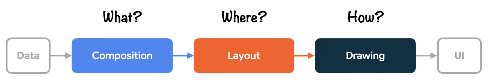
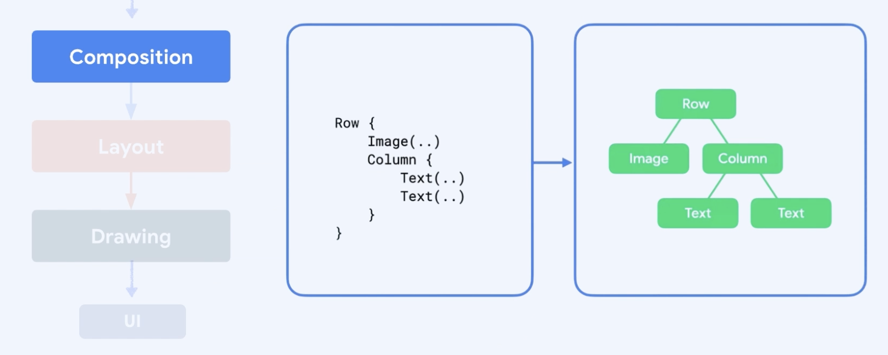
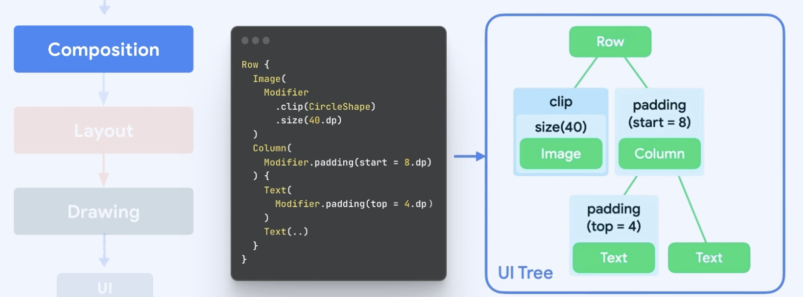
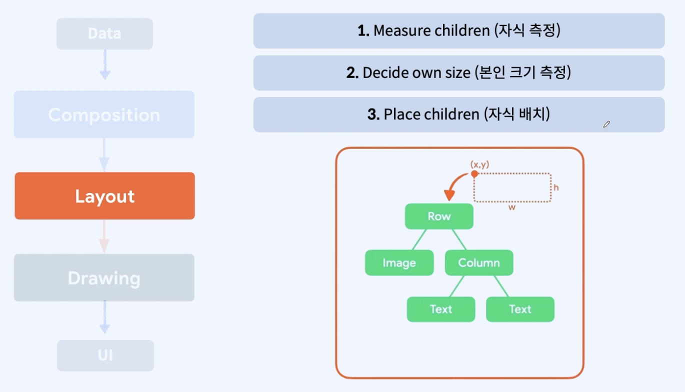
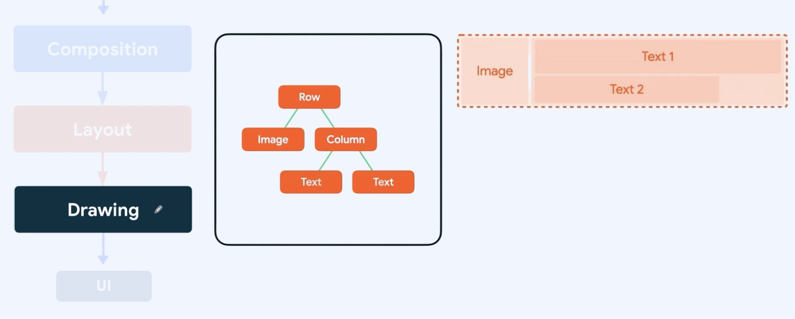

# [6주차] 단계, 성능

# 1. 단계

### 프레임의 세 단계

- Data → UI 그리는 과정 중에 세 단계를 거치게 된다.
    - **`What` Composition**
        - 화면에 무엇이 보여지게 할지 결정
    - **`Where`** **Layout**
        - 각 요소가 화면상 어디에 보여지게 할지 결정
    - **`How`** **Drawing**
        - 각 요소를 화면에 어떻게 그릴지 결정

### 1단계 - Composition (컴포지션)

- `@Composable`함수나 람다 블록 내의 상태 읽기는 잠재적으로 이후 단계에 영향을 미친다.
- 상태값이 변경되면 이 상태 값을 읽는 모든 Composable 함수의 Recomposition을 예약한다.

- 왼쪽과 같은 UI 코드를 → 실제 메모리 상에서 오른쪽과 같은 <u>트리</u> 형태로 변환한다.  
  (트리 == UI 트리)
- 컴포저블 함수 하나 → 트리에서 <u>노드</u> 하나 로 맵핑된다.  
  (노드 == Layout 노드)

ex)

- 컴포저블 함수에 Modifier가 설정되면 UI 트리에서 Modifier의 값으로 레퍼 노드(= Modifier 노드 = Layout 노드를 감싸는 노드)가 생성된다.
- 여러 Modifier들이 연결되어 있는 경우 (.clip().size()) → 체인되었다

### 2단계 - Layout (레이아웃)

- 트리를 탐색하면서 화면의 어떤 위치에 레이아웃 노드(컴포저블 함수)를 배치할지 결정한다.
- 3가지 알고리즘을 통해 트리를 탐색한다.
    - `Measure children` (자식 측정) ⇒ 현재 노드가 자식을 가지고 있다면,
    - `Decide own size` (본인 크기 측정) ⇒ 자식의 위치/크기를 기반으로 → 현재 노드 크기를 측정하고,
    - `Place children` (자식 배치) ⇒ 자식을 현재 노드 안에 상대적인 위치로 배치한다.

  → 모든 과정이 끝나면 레이아웃 노드에는 x좌표, y좌표, 너비, 높이 정보가 위와 같이 지정된다.

- 각 노드를 단 한 번만 방문되면서 화면에 그려진다.
    - 기존 xml 기반 안드로이드 뷰 시스템에 비해서 성능상으로 큰 이점이 된다!
    - 기존에는 중첩되면 느려지는 현상이 발생했는데, compose는 아무리 중첩되어도 전체 노드를 단 한 번만 방문하기 때문에 느려지지 않는다.

### 3단계 - Drawing (그리기)

- 그리기 코드 중 상태 읽기는 Drawing 단계에 영향을 미친다.

  ex) `Canvas()`, `Modifier.drawBehind`, `Modifier.drawWithContent`

- 상태 값이 변경되면 Compose UI는 Drawing 단계만 실행한다.

- Drawing 단계도 Layout 단계와 마찬가지로, 모든 노드들을 한 번씩만 방문하면서 그린다.

### 상태 읽기 최적화

- Compose에서 상태를 읽을 때 단계들이 각각 상태를 읽는다.
- 상태가 변경되었을 때 최소한의 단계에서만 실행될 수 있도록 해야 한다.
- 최적화는 상태 변경이 자주 발생하는 경우에 Recomposition을 방지하고 성능을 크게 향상시킬 수 있다.

---

# 2. 성능

### 3가지 Compose 단계가 성능에 미치는 영향

- 성능 개선 원칙
    1. 가능하면 컴포저블 함수 외부로 계산을 이동한다.
        - 컴포저블 함수는 UI가 변경될 때마다 다시 실행해야 할 수 있다.
        - 때문에 컴포저블 코드를 UI 빌드하는 데 실제로 필요한 것으로만 제한해야 한다.
    2. 최대한 오랫동안 상태 읽기를 연기한다.
        - 상태 읽기를 하위 컴포저블이나, 이후 단계로 이동시키면  
          → Recomposition을 최소화하거나 / Composition 단계를 완전히 건너뛸 수 있다.

          ex) 자주 변경되는 상태 대신 람다 함수 전달

          ex) 자주 변경되는 상태를 전달할 때 람다 기반 Modifier 기본으로 선택