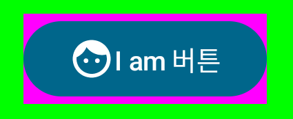
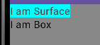

# 1주차

## Text

-  Text

```kotlin
@Composable
fun Text(
    text: String,
    modifier: Modifier = Modifier,
    color: Color = Color.Unspecified,
    fontSize: TextUnit = TextUnit.Unspecified,
    fontStyle: FontStyle? = null,
    fontWeight: FontWeight? = null,
    fontFamily: FontFamily? = null,
    letterSpacing: TextUnit = TextUnit.Unspecified,
    textDecoration: TextDecoration? = null,
    textAlign: TextAlign? = null,
    lineHeight: TextUnit = TextUnit.Unspecified,
    overflow: TextOverflow = TextOverflow.Clip,
    softWrap: Boolean = true,
    maxLines: Int = Int.MAX_VALUE,
    onTextLayout: (TextLayoutResult) -> Unit = {},
    style: TextStyle = LocalTextStyle.current
) {

    val textColor = color.takeOrElse {
        style.color.takeOrElse {
            LocalContentColor.current
        }
    }
    // NOTE(text-perf-review): It might be worthwhile writing a bespoke merge implementation that
    // will avoid reallocating if all of the options here are the defaults
    val mergedStyle = style.merge(
        TextStyle(
            color = textColor,
            fontSize = fontSize,
            fontWeight = fontWeight,
            textAlign = textAlign,
            lineHeight = lineHeight,
            fontFamily = fontFamily,
            textDecoration = textDecoration,
            fontStyle = fontStyle,
            letterSpacing = letterSpacing
        )
    )
    BasicText(
        text,
        modifier,
        mergedStyle,
        onTextLayout,
        overflow,
        softWrap,
        maxLines,
    )
}
```

- BasicText를 wrap하여 Material 가이드라인 준수
- Text 관련 속성을 mergedStyle로 묶어 BasicText로 넘기고 있다.


### Clickable Text


- 공백 문자 또한 클릭 위치로 간주된다 (6th Character)


## Button


```kotlin
    Button(onClick = { }) {
            Text(text = "I am 버튼")
        }
```

```kotlin
@Composable
fun Button(
    onClick: () -> Unit,
    modifier: Modifier = Modifier,
    (생략)
    colors: ButtonColors = ButtonDefaults.buttonColors(),
    elevation: ButtonElevation? = ButtonDefaults.buttonElevation(),
    (생략)
    content: @Composable RowScope.() -> Unit
) {
    val containerColor = colors.containerColor(enabled).value
    val contentColor = colors.contentColor(enabled).value
    val shadowElevation = elevation?.shadowElevation(enabled, interactionSource)?.value ?: 0.dp
    val tonalElevation = elevation?.tonalElevation(enabled, interactionSource)?.value ?: 0.dp
    ...
    Surface(
        onClick = onClick,
        ...
        color = containerColor,
        contentColor = contentColor,
        tonalElevation = tonalElevation,
        shadowElevation = shadowElevation,
        ...
    ) {
        CompositionLocalProvider(LocalContentColor provides contentColor) {
            ProvideTextStyle(value = MaterialTheme.typography.labelLarge) {
                Row(
                    ...
                    content = content
                )
            }
        }
    }
}
```
- content
    - Kotlin Convention에 따라 마지막 람다 파라미터인 content를 함수 바깥에 표시
        - https://kotlinlang.org/docs/lambdas.html#passing-trailing-lambdas
    - @Composable 함수이기 때문에 Composable 함수(컴포넌트)를 호출할 수 있다.
    - RowScope 이기 때문에 여러개의 컴포저블이 가로로 배치된다.


```kotlin
   Button(onClick = { }) {
            Icon(imageVector = Icons.Default.Face, contentDescription = null)
            Text(text = "I am 버튼")
        }
```

- button color, elevation을 가공해서 Surface로 넘기는 형태
    - `Modifier.background()`로 버튼 색상을 바꾸면 제대로 적용되지 않는 이유


```kotlin
    Button(
            modifier = Modifier.background(color = Color.Magenta),
            onClick = { }
        ) {
            Icon(imageVector = Icons.Default.Face, contentDescription = null)
            Text(text = "I am 버튼")
        }
```


## Modifier

- Modifier의 순서가 미치는 영향


```kotlin
    Column(
        modifier = Modifier
            .size(width = 300.dp, height = 200.dp)
            .background(color = Color.Green)
            .border(2.dp, color = Color.Black)
            .padding(20.dp)
    ) {
        Text(text = "Hello")
        Text(text = "Compose")
    }
```

크기 지정보다 padding을 먼저 적용한다면?


```kotlin
    Column(
        modifier = Modifier
            .padding(20.dp)
            .size(width = 300.dp, height = 200.dp)
            .background(color = Color.Green)
            .border(2.dp, color = Color.Black)
    ) {
        Text(text = "Hello")
        Text(text = "Compose")
    }
```
- 의도와 다른 결과물이 나올 수 있다.

```kotlin
@Stable
fun Modifier.padding(all: Dp) =
    this.then(
        PaddingModifier(
            start = all,
            top = all,
            end = all,
            bottom = all,
            rtlAware = true,
            inspectorInfo = debugInspectorInfo {
                name = "padding"
                value = all
            }
        )
    )
```
- Modifier의 속성을 부여하는 함수들은 `Modifier`의 확장함수
- 설정에 맞게 가공된 `Modifier`를 반환한다.

## Surface vs Box
- 과거 Compose UI 작성을 할 때, Surface와 Box를 비슷하게 혼용했었음
- 언제 무엇을 쓰는게 좋을까?

### Surface
```kotlin
@Composable
@NonRestartableComposable
fun Surface(
    onClick: () -> Unit,
    modifier: Modifier = Modifier,
    enabled: Boolean = true,
    shape: Shape = RectangleShape,
    color: Color = MaterialTheme.colorScheme.surface,
    contentColor: Color = contentColorFor(color),
    tonalElevation: Dp = 0.dp,
    shadowElevation: Dp = 0.dp,
    border: BorderStroke? = null,
    interactionSource: MutableInteractionSource = remember { MutableInteractionSource() },
    content: @Composable () -> Unit
) {
    val absoluteElevation = LocalAbsoluteTonalElevation.current + tonalElevation
    CompositionLocalProvider(
        LocalContentColor provides contentColor,
        LocalAbsoluteTonalElevation provides absoluteElevation
    ) {
        Box(
            modifier = modifier
                .minimumTouchTargetSize()
                .surface(
                    shape = shape,
                    backgroundColor = surfaceColorAtElevation(
                        color = color,
                        elevation = absoluteElevation
                    ),
                    border = border,
                    shadowElevation = shadowElevation
                )
                .clickable(
                    interactionSource = interactionSource,
                    indication = rememberRipple(),
                    enabled = enabled,
                    role = Role.Button,
                    onClick = onClick
                ),
            propagateMinConstraints = true
        ) {
            content()
        }
    }
}
```

- Surface는 Box를 감싸고 있다.
  - `Modifier.surface()`로 `Surface` 속성을 적용한다.
- `elevation`, `shape`, `color`의 Material Desgin style을 적용
  - Material의 ColorScheme 적용
- content의 scope가 따로 정해져 있지 않다.

### Box

```kotlin
@Composable
inline fun Box(
    modifier: Modifier = Modifier,
    contentAlignment: Alignment = Alignment.TopStart,
    propagateMinConstraints: Boolean = false,
    content: @Composable BoxScope.() -> Unit
) {
    val measurePolicy = rememberBoxMeasurePolicy(contentAlignment, propagateMinConstraints)
    Layout(
        content = { BoxScopeInstance.content() },
        measurePolicy = measurePolicy,
        modifier = modifier
    )
}
```
- contentAlignment로 content를 위치시킬 수 있다.
- 여러개의 Composable을 쌓을 수 있다.

### 정리
- 여러 개의 Child Composable를 쌓거나, 정렬해야 한다면 Box
- Material Design Guide를 따르는 Container로 사용한다면 Surface

 
```kotlin
    Column {
        Surface {
            Text(text = "I am Surface")
        }
        Box {
            Text(text = "I am Box")
        }
    }

    ---
    // Surface 색을 지정
    private val LightColorScheme = lightColorScheme(
        primary = Purple40,
        secondary = PurpleGrey40,
        tertiary = Pink40,
        surface = Color.Cyan,
        onSurface = Color.DarkGray)
```
- 아무런 색을 지정하지 않았을 때, Surface는 Surface, onSurface Color가 적용됨

## Layout (Box, Row, Column)


1. Compostion
2. Layout
3. Drawing

Compose는 위 3가지 과정을 거치며 UI를 그린다.

```kotlin
@Composable
fun SearchResult(...) {
  Row(...) {
    Image(...)
    Column(...) {
      Text(...)
      Text(..)
    }
  }
}
```
- 위 코드는 아래와 같은 UI 트리를 생성한다. 
```
SearchResult
  Row
    Image
    Column
      Text
      Text
```


- Layout을 그리는 과정
  - 상위 요소 측정 -> 하위 요소 측정 -> 하위 요소 배치 -> 상위 요소 배치
  - ➡ 하위 요소를 한번만 측정하기 때문에 깊은 UI 트리도 효율적으로 처리 가능 (single path)

### Box, Row, Column은 왜 inline fun일까?

공식 문서 영문버전의 Performance - Best Practices에 관련 내용이 한 줄 나옴
https://developer.android.com/jetpack/compose/performance/bestpractices
>  Note: Box is an inline function, so does not act as a recomposition scope.

➡ 6주차에 Recomposition을 공부하며 자세히 알아봐야겠습니다

## BoxWithConstraints

- `BoxScope`를 상속 받는 `BoxWithConstraintsScope`
- 아래와 같은 속성에 접근 가능하다.

```kotlin

@Stable
interface BoxWithConstraintsScope : BoxScope {
    val constraints: Constraints
    val minWidth: Dp
    val maxWidth: Dp
    val minHeight: Dp
    val maxHeight: Dp
}
```

- 아래 예시와 같이 레이아웃의 크기에 따라 UI를 지정할 수 있다.


```kotlin
    BoxWithConstraints(modifier = Modifier.fillMaxSize()) {
        if (minHeight < 200.dp) {
            Box(
                modifier = Modifier.fillMaxSize().background(color = Color.Blue)
            ) {
                Text(text = "...", modifier = Modifier.align(Alignment.Center))
            }
        } else {
            Box(
                modifier = Modifier.fillMaxSize().background(color = Color.Yellow)
            ) {
                Text(text = "Hello!", modifier = Modifier.align(Alignment.Center))
            }
        }
    }
```

- 아래 예시와 같이 Layout의 크기에 따라 적응형으로 구현할 수 있다.


https://proandroiddev.com/responsive-layouts-using-boxwithconstraints-in-jetpack-compose-7be64444812f