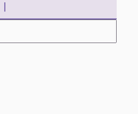
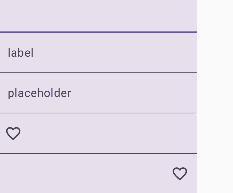
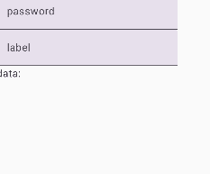
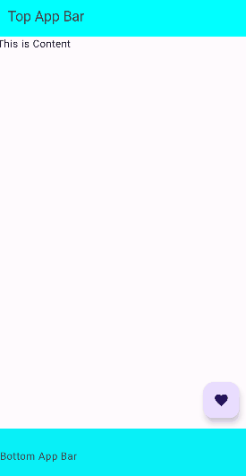
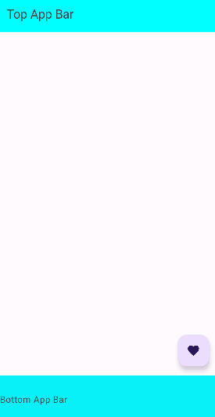

## Image

### 무심코 쓰는 contentDescription = null

https://m.blog.naver.com/boostcamp_official/222529787248

### Talk Back
- 스와이프로 이동, 두번 터치로 선택
- 실제 영상이 없어서 직접 녹화했어요

https://youtu.be/tAigk8rwffs

### image resource 가져오기

```kotlin
    Image(imageVector = ImageVector.vectorResource(id = R.drawable.title_logo), contentDescription = null)
    Image(painter = painterResource(id = R.drawable.img_eo), contentDescription = null)
```


## Checkbox
> 사용자가 클릭, 터치 등의 방법으로 상호작용할 수 있는 화면상의 요소는 안정적으로 상호작용할 수 있도록 충분히 커야 합니다. 이러한 요소의 크기를 조절할 때 Material Design 접근성 가이드라인을 정확히 준수하도록 최소 크기를 48dp로 설정해야 합니다.

> Checkbox, RadioButton, Switch, Slider, Surface와 같은 Material 구성요소는 이 최소 크기를 내부적으로 설정합니다. 단, 구성요소가 사용자 작업을 수신할 수 있는 경우에 한합니다. 예를 들어 Checkbox의 onCheckedChange 매개변수가 null이 아닌 값으로 설정된 경우 너비와 높이가 최소 48dp인 패딩이 포함됩니다


## TextField

```kotlin
    TextField(value = text, onValueChange = { text = it })
    OutlinedTextField(value = text, onValueChange = { text = it })
    BasicTextField(value = text, onValueChange = { text = it })
```


- BasicTextField의 decorationBox로 커스텀
- https://sungbin.land/jetpack-compose-%EB%82%98%EB%A7%8C%EC%9D%98-textfield-%EB%A7%8C%EB%93%A4%EA%B8%B0-1d117b37d2a7

```kotlin
    TextField(value = text, onValueChange = { text = it })
    TextField(
        value = text,
        onValueChange = { text = it },
        label = {
            Text(text = "label")
        },
    )
    TextField(
        value = text,
        onValueChange = { text = it },
        placeholder = { Text(text = "placeholder") },
    )

    TextField(value = text, onValueChange = { text = it }, leadingIcon = {
        Icon(
            imageVector = Icons.Default.FavoriteBorder,
            contentDescription = null,
        )
    })

    TextField(value = text, onValueChange = { text = it }, trailingIcon = {
        Icon(
            imageVector = Icons.Default.FavoriteBorder,
            contentDescription = null,
        )
    })
    
```


### VisualTransformation
- 입력 내용을 *로 변경해주는 `PasswordVisualTransformation`은 기본 제공
- `VisualTransformation`을 구현하여 원하는 형식에 맞게 입력 내용을 표현할 수 있음
    - data에는 영향을 주지 않고 표기에만 영향

010-0000-0000 형식으로 전화번호를 표시하는 VisualTransformation을 만들어봤습니당



```kotlin
class PhoneVisualTransformation : VisualTransformation {
    override fun filter(text: AnnotatedString): TransformedText {
        val trimmed = if (text.text.length > 11) text.text.substring(0 until 11) else text.text
        var out = ""
        for (i in trimmed.indices) {
            out += trimmed[i]
            if (i == 2 || i == 6) out += "-"
        }

        return TransformedText(AnnotatedString(out), phoneOffsetTranslator)
    }

    private val phoneOffsetTranslator = object : OffsetMapping {
        override fun originalToTransformed(offset: Int): Int {
            if (offset <= 2) return offset
            if (offset <= 6) return offset + 1
            if (offset <= 11) return offset + 2
            return 13
        }

        override fun transformedToOriginal(offset: Int): Int {
            if (offset <= 3) return offset
            if (offset <= 8) return offset - 1
            if (offset <= 13) return offset - 2
            return 11
        }
    }
}
```

```kotlin
var text by remember { mutableStateOf("") }

    Column {
        TextField(
            value = text,
            onValueChange = { text = it },
            label = {
                Text(text = "password")
            },
            visualTransformation = PasswordVisualTransformation(),
        )
        TextField(
            value = text,
            onValueChange = { text = it },
            label = {
                Text(text = "label")
            },
            visualTransformation = PhoneVisualTransformation(),
        )
        Text(text = "data: $text")
    }
```

## Slot Api

- 슬롯 빈 공간에 컴포넌트를 갈아끼우는 듯한 컴포즈 디자인 레이아웃 구조
- content 컴포저블 람다(content: @Composable () -> Unit) 형태로 하위 컴포넌트 전달
    - 하위 컴포넌트의 매개변수를 노출하지 않고 구성할 수 있음
    - ex) TopAppBar의 title, navigationIcon 및 actions

### Scaffold



```kotlin
var show by remember { mutableStateOf(true) }

    Scaffold(
        topBar = {
            if (show) {
                TopAppBar(
                    title = {
                        Text(text = "Top App Bar")
                    }
                )
            }
        },
        bottomBar = {
            if (show) {
                BottomAppBar {
                    Text(text = "Bottom App Bar")
                }
            }
        },
        floatingActionButton = {
            FloatingActionButton(onClick = { show = !show }) {
                Icon(imageVector = Icons.Default.Favorite, contentDescription = null)
            }
        }
    ) { innerPadding ->
        Text(text = "This is Content", modifier = Modifier.padding(innerPadding))
    }
```


- 하위 컴포저블에 `innerPadding`을 적용하지 않으면?

